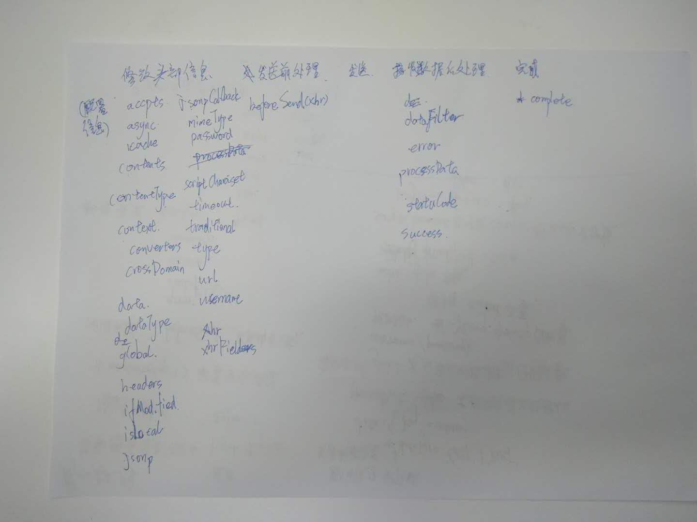

#ajax
jQuery封装的对XMLHttpRequest对象操作的方法。  
ajax可以实现前、后端异步通信。  
使用ajax的用法很简单。一些教程上提倡使用$.get(),$.post()方法。我更喜欢使用$.ajax({})，这种方法配制更方便。  

    $.ajax({
      option: value,
      option: value,
      option: value
    })

##$.ajaxSetup([options])
设置全局ajax默认选项  

    $.ajaxSetup({
      url: '/path/to/server',
      global: false,
      type: "POST"
    })

|$.get(url, [data], [callback], [type])|$.getJSON(url, [data], [callback]|$.getScript(url, [callback])|
|-|-|-|
|$.post(url, [data], [callback], [type])|no|no|

##ajax事件
ajaxStart(callback)  
ajaxSend(callback)  
ajaxError(callback)  
ajaxStop(callback)  
ajaxSuccess(callback)  
ajaxComplete(callback)  

    $('#id').ajaxStart(function(){$('.wait').removeClass('hide')})  

**回调函数：**  

- beforeSend
- error
- dataFilter
- success
- complete

**数据类型：**  

- xml
- html
- json/jsonp
- script

**发送方式：**  

- GET
- POST
- DELETE
- PUT

**高级选项：**  

我赞同这种名称。因为不能确定什么样的选项才是高级选项。选项为什么会的高级和不高级之分呢？  
我认为应当称呼为“细致选项”。  

- global
- username/password
- timeout
- cache
- scriptCharset
- async

**各参数：**  

|参数|类型|默认值|说明|
|-|-|-|-|
|url|*link*|-|请求的地址|
|accepts|boolean|true|告诉服务器什么样的响应接受返回|
|beforeSend(xhr)|function|-|在发送前修改xhr对象|
|cache|boolean|true|是否缓存此页面|
|complete(xhr, ts)|function|-|异步请求完成后回调函数|
|contents|map|-|以"{key:reg}"配对的对象|
|contentType|string|'application/x-www-form-urlencoded'|发送到服务器时内容编码类型|
|converters|map|{'* text': window.String, 'text html': true, 'text json': jQuery.parseJSON, 'text xml': jQuery.parseXML}|一个数据类型对数据类型转换器的对象|
|crossDomain|map|false|-|
|data|object/string|-|发送到服务器的数据|
|dataFilter(data, type)|function|-|处理异步请求回来的数据。data:请求的数据，type: datatype|
|dataType|string|http包mMINE信息来智能判断|预期服务器返回的数据类型|
|error(xhr, textStatus, errorThrown)|function|-|请求失败时调用|
|global|boolean|true|是否触发全局ajaj事件|
|headers|map|{}|可覆盖beforeSend函数范围内的任何设置|
|ifModified|boolean|false|只在服务器改变时获取新数据|
|isLocal|map|取决于当前的位置协议|允许当前环境被认定为“本地”|
|jsonp|string|-|-|
|jsonpCallback|string|-|-|
|mimeType|string|-|指定mime类型来覆盖xhr的MIME类型|
|password|string|-|用于响应http访问谁请求的密码|
|processData|boolean|true|是否处理转化成一个查询字串|
|scriptCharset|string|-|中有当请求时dataType为"jsonp"或"script"，并且type是"GET"才会用于强制修改charset。通常只在本地和远程的内容编码不同时使用。|
|statusCode|map|{}|它是通信的状态码。当响应是调用相应的代码|
|success(data, textStatus, jqxhr)|function,array|-|在异步请求成功后执行。data:请求的数据，textStatus:通信状态码，jqxhr：XMLGttpRequest。也可设置为一个函数组成的数组。每个函数被依次调用。|
|traditional|boolean|-|-|
|timeout|number|-|请求超时时间|
|type|string|'GET'|http请求方法|
|url|string|当前页面地址|发送请求的地址|
|xhr|function|-|-|
|xhrFields|map|-||

**ajax的处理过程**  

----
2018/02/12 by stone

