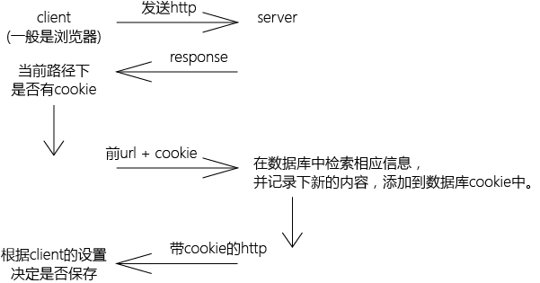
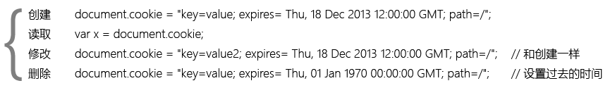

#cookie
1. cookie："小饼干，小甜品"
2. 参与http通信。因为在http中可以看到cookie，所以易受到攻击。
3. 面向路径。只作用于当前路径（页面）。

**运行机制**  
  

**使用**  
  

##总结
**设置cookie的值**  

    function setCookie(key, value, duration) {
        // duration 单位为ms
        var d = new Date();
        document.cookie = key + "=" + value + "; " + d.getTime() + duration
    } 

**获取cookie的值**  

    function getCookie(key) {
        var cookieArr = document.cookie.split(';');
        for (var i = 0; i < cookieArr.length; i++) {
            var cookie = cookieArr[i].trim();
            if (cookie.indexOf(key)===0) {
                return cookie.substring(key.length, key.cookie.length);
            }
        }
    } 

---
2018/03/25 by stone