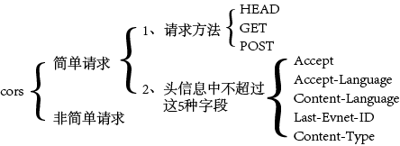
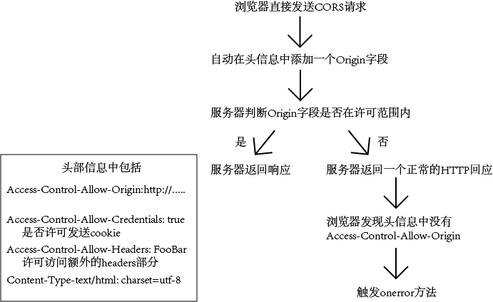
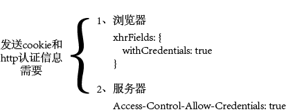
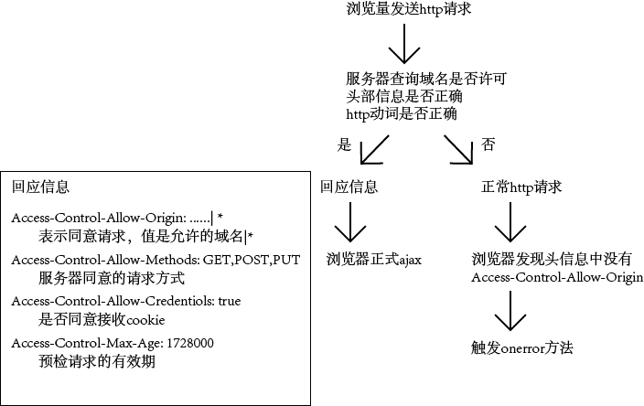

# CORS
Corss-Origin Resource Sharing 跨域资源共享  

兼容：ie10+  
整个cors通信都是自动的。  
关键在于服务器端。  

  
**运行机制**  
  

##简单请求 
对于编程者来说，大致上不用管。  
**运行机制:**  
  
  
必须同时设置。一个是浏览器请允许发送cookie。一个是服务器允许接收cookie。  

##非简单请求   
对服务器有特殊要求的请求。例如：PUT|DELETE|Content-type: application/json  
   
**预检**  
  

---
2018/03/07 by stone 

