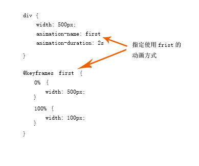

# css3动画 #
@keyframes规则内指定一个CSS样式和动画将逐步从目前的样式更改为新的样式。  

	div
	{
	    animation: myfirst 5s;
	    -webkit-animation: myfirst 5s; /* Safari 与 Chrome */
	}
	
	@keyframes myfirst
	{
	    0%   {background: red;}
	    25%  {background: yellow;}
	    50%  {background: blue;}
	    100% {background: green;}
	}
	 
	@-webkit-keyframes myfirst /* Safari 与 Chrome */
	{
	    0%   {background: red;}
	    25%  {background: yellow;}
	    50%  {background: blue;}
	    100% {background: green;}
	}

**功能**  
- 可以改变任意多的样式，任意多的次数。  
- 使用`from`,`to`等同于0%，100%  
- 最好使用0% 100%（对浏览器好）  

**属性**  

- @keyframes 规定动画  
- animation 简写发展  
- animation-name 规定@keyframes的名称  
- animation-duration  
- animation-timing-function linear|ease|ease-in|ease-out|cubic-bezier  
- animation-delay  
- animation-iteration-count 动画重复播放的次数  
- animation-direction 定义动画在下一周期是否逆向播放 normal|reverse|alternate|alternate-reverse|initial|inherit  
- animation-play-state 定义动画是否运行或停止 paused|runing  

----------
1/17/2018 12:30:38 PM 