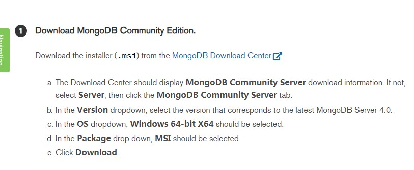
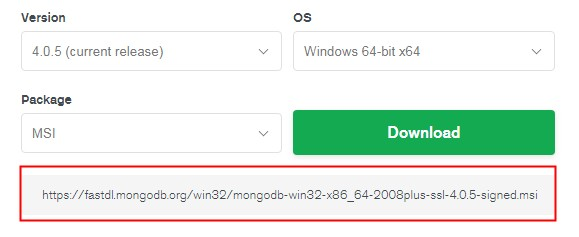
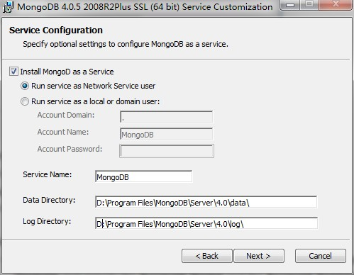
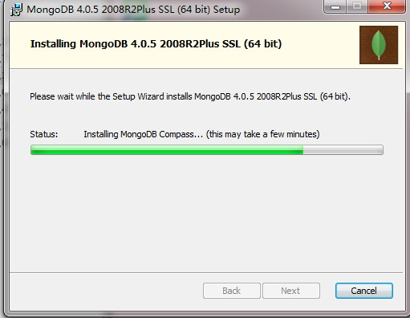

##1. 去官网进入下载说明页面。

`https://docs.mongodb.com/manual/tutorial/install-mongodb-on-windows/#install-mongodb-community-edition-on-windows`

##2. 下载

官网的文档说了3个步骤去安装。  
先进入下载页面`https://www.mongodb.com/download-center/community?jmp=docs`  
选择想要有版本、配置。  
复制这个链接，在讯雷中下载。  

##3. 安装时的配置

安装类型有2个（complete/custom）。选择custom可以设置安装位置。  
安装位置建议在非c盘。  
  
取消选择`Install MongoDB Compass`会快。因为勾选上会下载mongodb compass（图形化管理界面）很久。  
  

##4. 验证是否安装成功

进入安装目录的bin目录下。打开cmd命令行。  
执行`mongod dbpath ***\MongoDB\data\db`  
  
在浏览器中输入`http://localhost:27017`。能看到`It looks like you are trying to access MongoDB over HTTP on the native driver port.`。说明安装成功。  

---

2019/01/04 by stone