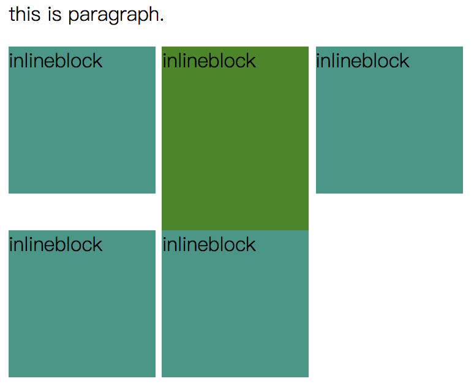
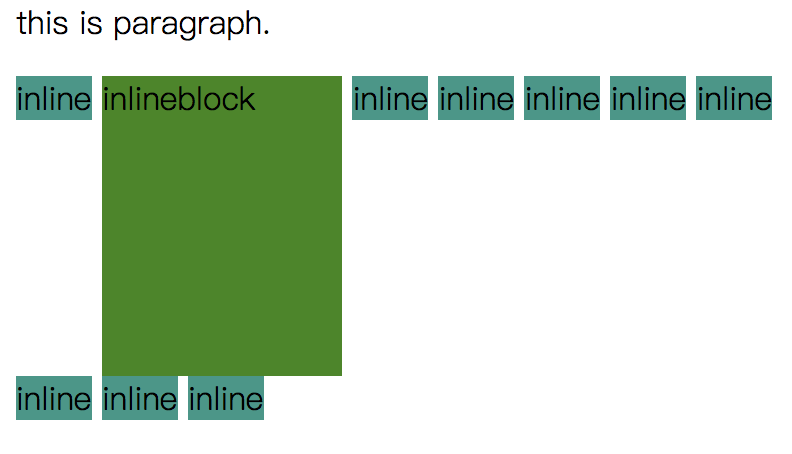
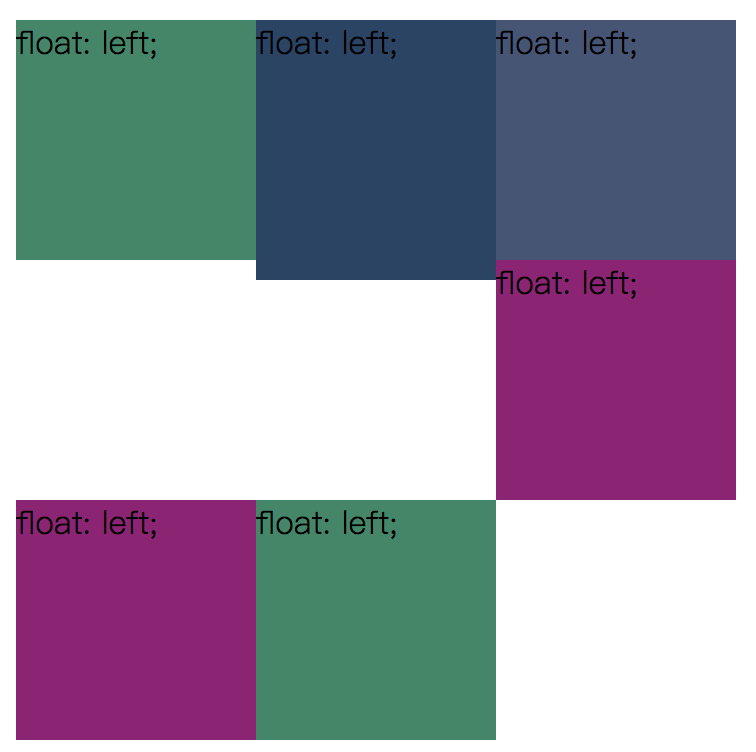
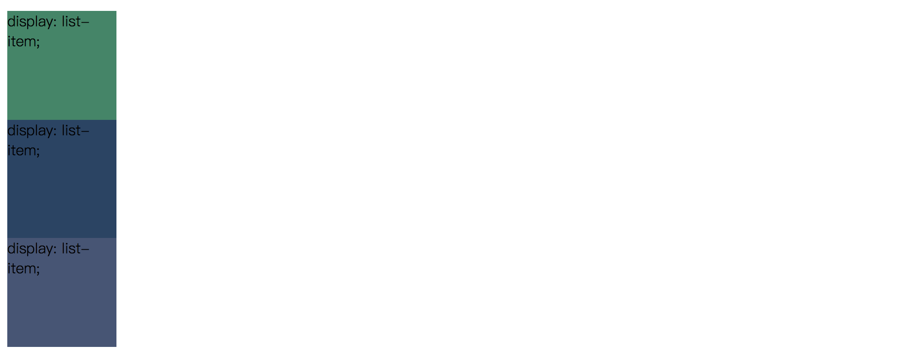
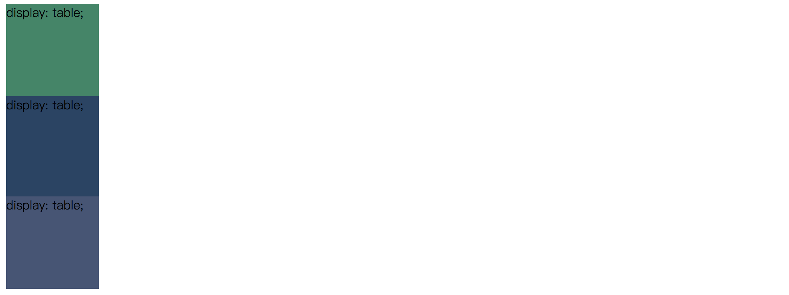

# display
##说明
控制当前元素按照什么方式显示。  

|value|describe|
|-|-|
|none||
|block||
|list-item||
|inline||
|inline-block||
|inline-table||
|table|块级表格|
|table-row-group||
|table-header-group||
|table-footer-group||
|table-row||
|table-column-group||
|table-column||
|table-cell||
|table-caption||
|grid|按网格形式布局|
|flex|弹性布局|

##测试的例子
  

使用display:inline-block;时，各dom间有一个间隙。因为写代码时用了换行符。  
解决间隙的方法：  

- font-size: 0px;
- 写代码时不用换行符。
  

使用float:left;时，各dom间没有间隙，但是在各dom块高度不同是各行元素不能水平对齐。

  

使用display: list-item;  

  

使用display:table;  

