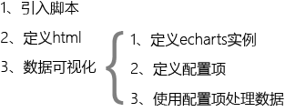
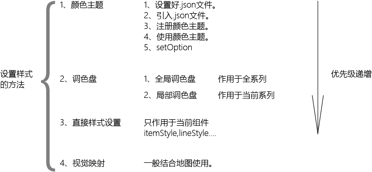
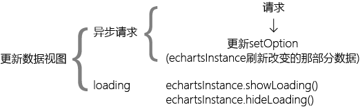

#echarts
##简介

1. 一种数据可视化前端插件。  
2. 由百度基于。。开发的。
3. 就结合地图的数据可视化比较好，但是现在不能使用地图了。

其它的[数据可视化](http://selection.datavisualization.ch/)插件  
想用地图的话在这里找一个插件吧。  

  

##基本使用

  
[源代码](https://github.com/feigebaobei/echarts/blob/master/html/sample.html)  
---

  
[源代码](https://github.com/feigebaobei/echarts/blob/master/html/visualmap.html)  
---

  
[源代码](https://github.com/feigebaobei/echarts/blob/master/html/ajaxdata.html)
---

