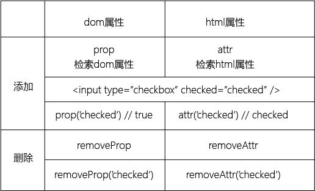

#prop()
设置或得到一个元素的dom属性和值  

    $('#id').prop(property)
    $('#id').prop(property, value)
    $('.class').prop(property, function (index, currentvalue) {return value})
    // index 集合中元素的index位置
    // currentvalue 被选元素的当前属性
    $('#id').prop({property0: value0, property1: value1, property2: value2, ...})

#attr()
设置或得到一个元素的html属性和值  

    $('#id').attr(attribute)
    $('#id').attr(attribute, value)
    $('.class').attr(attribute, function (index, currentvalue) {return value})
    // index 集合中元素的index位置
    // currentvalue 被选元素的当前属性
    $('#id').attr({attribute0: value0, attribute1: value1, attribute2: value2, ...})

#removeProp()
移除一个元素的dom属性  

    $('#id').removeProp(property)

#removeAttr()
移除一个元素的html属性  

    $('#id').removeAttr(attrbute)

  

#select
##简介
下拉框  

##方法
###得到、设置select的value

    $('#id').val()

###得到select中选中的option的value

    $('#id').find('option:selected').val()
    $('#id').val()

###得到select中选中的option的text

    $('#id').find('option:selected').text()

###得到text="t"的option的value

    var getValueByText = function () {
        for (var i = 0, iLen = $('#id').find('option').length; i < iLen; i++) {
            if ($('#id').find('option').eq(i).text === 't') {
                return $('#id').find('option').eq(i).val()
            }
        }
    }

###判断select中是否存在一个value='v'的option

    var isExitOptValue = function (jqObj, v) {
        // jqObj select的jq对象
        for (var i = 0, iLen = jqObj.find('option').length; i < iLen; i++) {
            if (jqObj.find('option').eq(i).val === v) {
                return true
            }
        }
        return false
    }

###在select中添加一个option

    var addOptAtSelect = function (jqObj, v, t) {
        if (isExitOptValue(jqObj,v)) {
            return false    
        } else {
            jqObj.append('<option value='+v+'>'+t+'</option')
            return true
        }
    }

###在select中删除一个指定value的option

#radio
##简介
单选  

#checkbox
##简介
选择框  

---
2018/04/02 by stone
