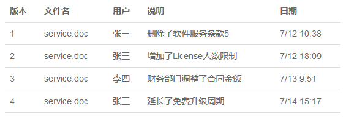
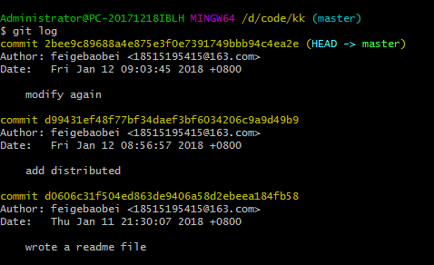
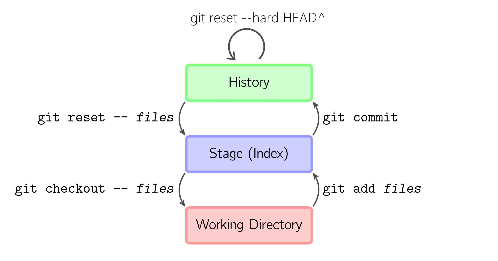
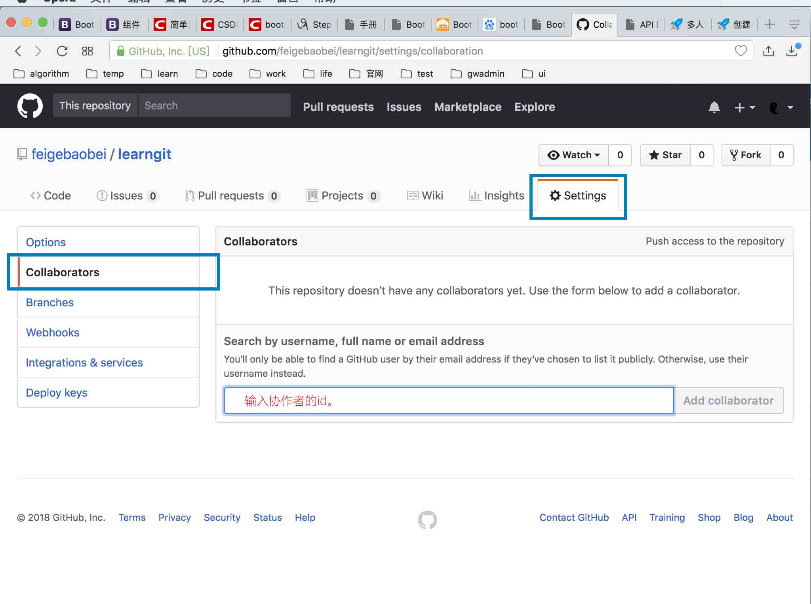

#Git  

**功能**  
1. 记录每次文件的改动。(git跟踪并管理的是修改，而不是文件。)
2. 多人协作编辑。

Git是目前世界上最先进的分布式版本控制系统（没有之一）。 
版本管理效果如下图。 
  

##install Git  

**linux**  

	sudo apt-get install git

**Mac OS**  

1. 一是安装homebrew，然后通过homebrew安装Git，具体方法请参考homebrew的文档：http://brew.sh/。
2. 第二种方法更简单，也是推荐的方法，就是直接从AppStore安装Xcode，Xcode集成了Git，不过默认没有安装，你需要运行Xcode，选择菜单“Xcode”->“Preferences”，在弹出窗口中找到“Downloads”，选择“Command Line Tools”，点“Install”就可以完成安装了。

**Windows**  

在Git官网直接下载安装程序

	$ git config --global user.name "Your Name"
	$ git config --global user.name "email@example.com"

因为Git是分布式版本控制系统，所以，每个机器都必须自报家门：你的名字和Email地址。你也许会担心，如果有人故意冒充别人怎么办？这个不必担心，首先我们相信大家都是善良无知的群众，其次，真的有冒充的也是有办法可查的。  
也可以下载git for windows

##create repository  

	$ mkdir learngit
	$ cd learngit
	$ pwd 
	/Users/michael/learngit
pwd命令用于显示当前目录。
	$ git init
在learngit文件夹下会创建一个叫.git的文件夹。  
git只能跟踪文本文件的改动  
*tip:*不要使用记事本写代码。请使用notepad++/sublime/...  
	$ git add <file>
	$ git commit

**修改、提交文件**  

当用户在修改过文档后  

	$ git status// 查看当前库的状态。哪些文件被修改过。是否放到git舞台。
	$ git diff// 查看被修改的地方
	$ git add readme.txt// 在提交前添加需要提交的文件
	$ git status
	$ git commit -m "message of resolve"//提交

##版本回退  
当反修改过的文本提交后都会有一个相应的版本号生成。如下图

	$ git log // 查看提交的日志
  

	$ git reset --hard HEAD^
`HEAD`表示当前版本  
`HEAD^`表示上一个版本  
`HEAD^^`表示上上个版本  
`HEAD~100`表示上100个版本  
`git reset`表示把版本重新设置为……版本  
`HEAD`是指向版本的指针  

##版本前进  
在不关闭命令行窗口的情况下。我们还可以看到在执行`git log`时输出的各版本信息。  

	$ git reset --hard 2bee9c89
在`--hard`后写下版本号。（可以不写全，git会帮我们找到，要从开头写，也叫做commit id）。  

	$ git reflot// 查看命令历史  

##工作区(working directory)  
工作区就是.git文件夹在的文件夹  

##版本库  
.git就是版本库  
Git的版本库里存了很多东西，其中最重要的就是称为stage（或者叫index）的暂存区。在我们第一次创建仓库时会自动创建一个分支`master`。有一个`HEAR`指针指向`master`  
  
从修改文件到提交文件需要做
1. 把修改过的文件添加到舞台。（添加到舞台后再修改文件还需要添加到舞台）  
2. 把舞台上的文件移出舞台（在把文件添加到舞台后，提交前。有可能会用到。）
2. 把舞台内的文件提交。  

	$ git add <file> <file>

	$ git reset HEAD <file>

	$ git commit -m 'message'
  
现在暂存区就没有任何东西了。  

##撤销修改  
- 把修改过的文件已经添加到暂存区  

		$ git reset HEAD <file> // 
		$ git checkout -- <file>

  

##删除文件  
	$ rm <file>//git知道删除了文件，但是工作区和版本库不一致。这时需要下面这一步。
	$ git rm <file>
	$ git commit -m "message"
如果在`$ rm <file>`误删了。需要恢复回来。

	$ git checkout -- <file>

##删除untracked file  

	$ git clean -f

##把本地代码推到远程仓库
1. 生成ssh key.  
	$ ssh-keygen -t rsa -C '18515195415@163.com'
3. 在github网站上添加第一步中生成的ssh key。
2. 在github网站上创建一个新的仓库。
3. 关联本场仓库和远程仓库。
	$ git remote add origin git@github.com:feigebaobei/learngit.git
4. 把本场库的内容推送到远程库上。
	$ git push -u origin master // 第一次
	$ git push origin master // 第二次及以后

##从远程克隆仓库
1. 在远程（如：github）创建一个仓库。
2. 克隆这个仓库
	$ git clone git@github.com:feigebaobei/gitskills.git

##分支
1. 创建分支
	$ git branch dev
2. 切换分支
	$ git checkout dev
3. 查看当前分支
	$ git branch
4. 合并分支
	$ git merge dev // 把dev分支合并到当前分支
	git在fast forward模式下，删除分支后会丢掉分支信息。在--no-ff下，git会在merge时生成一个新的commit。这样就可以看到分支信息。
	$ git merge --no-ff -m 'merge with no-ff' dev
5. 删除分支
	$ git branch -d dev
	强行删除用-D
6. 处理冲突
	若合并分支时报错。说明2个分支中有同一个文件有不同的修改。这时需要把当前分支上的文件内容修改为要合并的分支上的文件一样。然后再合并。
7. 查看分支合并图
	$ git log --graph
*tip:*master分支上是非常稳定的版本，用于发布。开发在dev分支上。各开发者在dev分支上再创建自己的分支。  
##bug分支  
1. git stash // 我不知道为什么会用到它。

##多人协作
1. 创建仓库。
2. 设置协作者。
  
把链接发给他，他接受请求后就可以一起开发同一个项目了。  
3. 克隆项目
4. 创建分支。就是项目中已经有了分支，在新克隆的项目中也协作者也看不到。需要协作者再创建一次相同名的分支。
5. 编辑项目后先pull再push。
	$ git pull origin dev
	$ git push origin dev

##标签管理
1. 创建标签。
	$ git tag v1.0
	$ git tag v1.0 f52c633
2. 查看所有标签
	$ git tag
3. 查看标签信息
	$ git show v1.0
4. 为标签写说明
	$ git tag -a v1.0 -m 'version 1.0'
	$ git tag -a v1.0 -m 'version 1.0' f52c633
5. 删除标签
	$ git tag -d v1.0
6. 推送标签到远程库
	$ git push origin v1.0

##上传大于100m的文件。
我找到2种方法。1，git large file storage 2, 配置上传大小阈值。  
** 1. git large file storage **  
[这是文章链接](http://www.liuxiao.org/2017/02/git-处理-github-不允许上传超过-100mb-文件的问题/)  
[这里还有一个文章链接](https://blog.csdn.net/Tyro_java/article/details/53440666)  
** 2. 配置上传大小阈值 **
	
	$ cd file/path
	$ git config http.postBuffer 314572800

我设置成最大300m.(300*1024*1024=314572800)

## 查看git配置信息  

	git config --global --list // 查看当前用户（global）配置
	git config --system --list // 查看系统config
	git config --local --list // 查看当前仓库配置信息

## 测试是否联通  

	ssh -T git@github.com
	ssh -T git@gitlab.com

