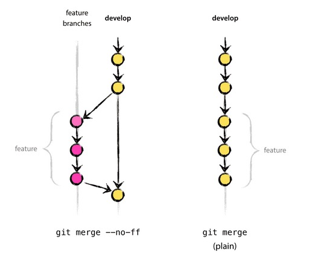
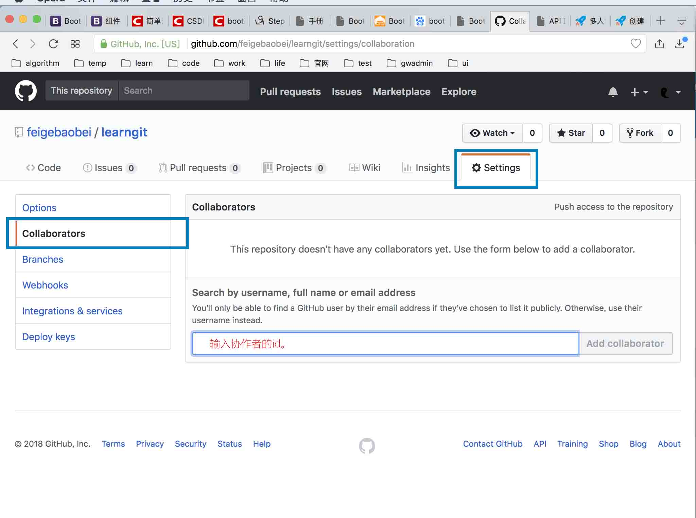

#Git  

**基本概念**  

commitID 全球版本号 git库的版本号是通过sha-1算法得到一个40位的哈希值。这个哈希值全球惟一，基本只要前6位就可以唯一标识。  

**功能**  
1. 记录每次文件的改动。(git跟踪并管理的是修改，而不是文件。)
2. 多人协作编辑。

Git是目前世界上最先进的分布式版本控制系统（没有之一）。 
版本管理效果如下图。 
  

##install Git  

**linux**  

	sudo apt-get install git

**Mac OS**  

1. 一是安装homebrew，然后通过homebrew安装Git，具体方法请参考homebrew的文档：http://brew.sh/。
2. 第二种方法更简单，也是推荐的方法，就是直接从AppStore安装Xcode，Xcode集成了Git，不过默认没有安装，你需要运行Xcode，选择菜单“Xcode”->“Preferences”，在弹出窗口中找到“Downloads”，选择“Command Line Tools”，点“Install”就可以完成安装了。

**Windows**  

在Git官网直接下载安装程序  

	$ git config --global user.name "Your Name"
	$ git config --global user.email "email@example.com"
	
	$ git config --local user.name "Your Name"
	$ git config --local user.email "email@example.com"	

因为Git是分布式版本控制系统，所以，每个机器都必须自报家门：你的名字和Email地址。你也许会担心，如果有人故意冒充别人怎么办？这个不必担心，首先我们相信大家都是善良无知的群众，其次，真的有冒充的也是有办法可查的。  
也可以下载git for windows

##删除 repository

	$ rm -rf .git

##create repository  

	$ mkdir learngit
	$ cd learngit
	$ pwd 
	/Users/michael/learngit
pwd命令用于显示当前目录。
	$ git init
在learngit文件夹下会创建一个叫.git的文件夹。  
git只能跟踪文本文件的改动  
*tip:*不要使用记事本写代码。请使用notepad++/sublime/...  
	$ git add <file>
	$ git commit

**修改、提交文件**  

当用户在修改过文档后  

	$ git status// 查看当前库的状态。哪些文件被修改过。是否放到git舞台。
	$ git diff// 查看被修改的地方
	$ git add readme.txt// 在提交前添加需要提交的文件
	$ git status
	$ git commit -m "message of resolve"//提交
    $ git commit --amend // 修改git commit i 进入编辑状态 修改注释 esc :wq

**取消跟踪文件**  

	$ git rm --cached file.ext // 删除file.ext的跟踪,并保留本地文件.
	$ git rm --f file.ext // 删除file.ext的跟踪,并删除本地文件.
	$ git commit -m 'note' // 一定要有这步
	// 不建议使用.gitignore方法

##版本回退  
当反修改过的文本提交后都会有一个相应的版本号生成。如下图

	$ git log // 查看提交的日志
  

	$ git reset --hard HEAD^
	git reset --soft <commit> // 重置head，不碰触文件。
	git reset --hard <commit> // 重置head.把跟踪文件改为修改前
	git reset --mixed <commit> // git reset <commit>的默认操作。重置head,不重置工作树。保存文件变更，不标记为commit
	git reset --merge <commit> // 重置head.保留工作树与commit之间不同的文件。若这些文件有没有添加到舞台的文件，则中止重置。
	git reset --keep <commit> // 重置head.保留工作树与commit之间不同的文件。若这些文件有本地变更，则中止重置。
`HEAD`表示当前版本  
`HEAD^`表示上一个版本  
`HEAD^^`表示上上个版本  
`HEAD~100`表示上100个版本  
`git reset`表示把版本重新设置为……版本  
`HEAD`是指向版本的指针  

	git reset // 提交回滚，使用当前提交替换一个指定的版本。
	git reset // 重置指定版本。默认参数 --soft 把commit的修改退回到git缓冲区。 --hard 把commit的修改丢弃。  
	git reset --hard HEAD^
	git reset --hard <commitID>
	git push -f -u origin <branchName>

##版本前进  
在不关闭命令行窗口的情况下。我们还可以看到在执行`git log`时输出的各版本信息。  

	$ git reset --hard 2bee9c89
在`--hard`后写下版本号。（可以不写全，git会帮我们找到，要从开头写，也叫做commit id）。  

	$ git reflog// 查看命令历史  

##工作区(working directory)  
工作区就是.git文件夹在的文件夹  

##版本库  
.git就是版本库  
Git的版本库里存了很多东西，其中最重要的就是称为stage（或者叫index）的暂存区。在我们第一次创建仓库时会自动创建一个分支`master`。有一个`HEAR`指针指向`master`  
  
从修改文件到提交文件需要做
1. 把修改过的文件添加到舞台。（添加到舞台后再修改文件还需要添加到舞台）  
2. 把舞台上的文件移出舞台（在把文件添加到舞台后，提交前。有可能会用到。）
2. 把舞台内的文件提交。  

	$ git add <file> <file>

	$ git reset HEAD <file>

	$ git commit -m 'message'
  
现在暂存区就没有任何东西了。  

##撤销修改  
- 把修改过的文件已经添加到暂存区  

		$ git reset HEAD <file> // 
		$ git checkout -- <file>

  

##删除文件  
	$ rm <file>//git知道删除了文件，但是工作区和版本库不一致。这时需要下面这一步。
	$ git rm <file>
	$ git commit -m "message"
如果在`$ rm <file>`误删了。需要恢复回来。

	$ git checkout -- <file>

##删除untracked file  

	$ git clean -f

##把本地代码推到远程仓库
1. 生成ssh key.  
	$ ssh-keygen -t rsa -C '18515195415@163.com'
3. 在github网站上添加第一步中生成的ssh key。
2. 在github网站上创建一个新的仓库。
3. 关联本场仓库和远程仓库。
	$ git remote add origin git@github.com:feigebaobei/learngit.git
	$ git remote add origin http://****:****/xxx.git
4. 把本场库的内容推送到远程库上。
	$ git push -u origin master // 第一次
	$ git push origin master // 第二次及以后

##从远程克隆仓库
1. 在远程（如：github）创建一个仓库。
2. 克隆这个仓库
	$ git clone git@github.com:feigebaobei/gitskills.git
	$ git clone http://****:****/xxx.git

    $ git remote rm origin
    $ git remote add origin git@...

##分支
1. 创建分支
	$ git branch dev
	$ git checkout dev
	$ git add --all
	$ git commit -m 'dev'
	$ git push -u origin dev
2. 切换分支
	$ git checkout dev
3. 查看当前分支
	$ git branch
4. 合并分支
	$ git merge dev // 把dev分支合并到当前分支
	git在fast forward模式下，删除分支后会丢掉分支信息。在--no-ff下，git会在merge时生成一个新的commit。这样就可以看到分支信息。在对于bug分支、功能分支合并时一般不关心每一次提交的版本，只要最后的版本。这时使用ff模式。  
	$ git merge --no-ff -m 'merge with no-ff' dev  
	  
5. 删除分支
	$ git branch -d dev
	强行删除用-D
	$ git push origin --delete dev // 删除远程分支 dev
6. 处理冲突
	若合并分支时报错。说明2个分支中有同一个文件有不同的修改。这时需要把当前分支上的文件内容修改为要合并的分支上的文件一样。然后再合并。
7. 查看分支合并图
	$ git log --graph
8. 比较2个分支的文件差异  
	$ git diff branch1 branch2 --stat // 显示出所有有差异的文件列表.
	$ git diff branch1 branch2 <path/to/file> // 显示指定文件的详细差异.  
	$ git diff branch1 branch2 // 显示出所有有差异的文件的详细差异.  
	$ git diff version1 version2
	$ git log dev ^master // 查看dev有，master没有的提交。  
	$ git log master..dev // 查看dev比master多提交了哪些提交内容。  
	$ git log dev...master // 查看有什么不一样的提交。  
8. 拉取远程分支
	git fetch
	git checkout -b localbranchname origin/oribranchname // 本地分支与远程分支会建立映射关系。
	git fetch origin oribranchname:localbranchname // 本地分支与远程分支不会建立映射关系。
	git branch --set-upstream-to origin/oribranchname localbranchname // 使本地分支与远程分支建立映射关系
*tip:*master分支上是非常稳定的版本，用于发布。开发在dev分支上。各开发者在dev分支上再创建自己的分支。  
##bug分支  
1. git stash // 暂存内容
	
> git stash save // save
> git stash list // find all stash list
> git stash pop [stashIndex] // pop last stash 或弹出指定stash的内容。 git stash pop stash@{1}
> git stash show // show diff cur stash and last push
> git stash show [stash@{1}] [-p] // 查看哪些地方不同
> git stash apply // 当前变化合并到最后一次stash
> git stash drop [stashIndex] // drop stashIndex
> git stash clear // clear all stash
> 

当使用`git stash pop`出现冲突时,git不会删除保存在stash中的记录。需要使用`git stash drop`进行删除。  

##多人协作
1. 创建仓库。
2. 设置协作者。
  
把链接发给他，他接受请求后就可以一起开发同一个项目了。  
3. 克隆项目
4. 创建分支。就是项目中已经有了分支，在新克隆的项目中也协作者也看不到。需要协作者再创建一次相同名的分支。
5. 编辑项目后先pull再push。
	$ git pull origin dev
	$ git push origin dev

##标签管理
1. 创建标签。
	$ git tag v1.0
	$ git tag v1.0 f52c633
	git tag v0.0.1 // 轻量级标签（保存提交对象的校验与信息的文件）
	git tag -a v0.0.2 -m 'comment' // 含附注标签（）
	git tag -s v0.0.2 -m 'comment'	 // 签署标签（）
2. 查看所有标签
	$ git tag // 查看所有标签
    $ git tag -l 'v1.4.*' // 查看1.4.*的版本
3. 查看标签信息
	$ git show v1.0
4. 为标签写说明
	$ git tag -a v1.0 -m 'version 1.0'
	$ git tag -a v1.0 -m 'version 1.0' f52c633
5. 删除标签
	$ git tag -d v1.0
6. 推送标签到远程库
	$ git push origin v1.0

##上传大于100m的文件。
我找到2种方法。1，git large file storage 2, 配置上传大小阈值。  
** 1. git large file storage **  
[这是文章链接](http://www.liuxiao.org/2017/02/git-处理-github-不允许上传超过-100mb-文件的问题/)  
[这里还有一个文章链接](https://blog.csdn.net/Tyro_java/article/details/53440666)  
** 2. 配置上传大小阈值 **
	
	$ cd file/path
	$ git config http.postBuffer 314572800

我设置成最大300m.(300*1024*1024=314572800)

## 查看git配置信息  

	git config --list // 查看当前用户在当前库的配置信息
	git config --global --list // 查看当前用户（global）配置
	git config --system --list // 查看系统config
	git config --local --list // 查看当前仓库配置信息

## 测试是否联通  

	ssh -T git@github.com
	ssh -T git@gitlab.com

## git 规范  

|分类|名称|命名方式|是否可删|
|-|-|-|-|
|master|主分支|-|否|
|dev|主要开发分支|-|否|
|-|f_li_1012_select|f_yourname_time_function|及时删除|
|-|dev_li_1012_select|dev_yourname_time_function|及时删除|
|-|bug_li_1012_select|bug_yourname_time_function|及时删除|  

commit 必须写注释。  
先pull再push  
有冲突必须解决 `git reset HEAD HEAD^`  
merge前保证当前工作区干净  

## merge规范
|key|全称|description||
|-|-|-|-|
|feat|-|新增功能||
|to||正在修改bug||
|fix||已经修改完成bug||
|docs||仅仅修改了文档||
|style||修改代码缩进等。不改变代码逻辑||
|refactore||代码重构。||
|perf|-|优化||
|test||测试用例||
|chore||改变构建流程/增加依赖/工具||
|revert||回滚||

`<key>(scope): content`

## git hook
执行git init时会生成`.git`目录。其下的`hooks`目录是git的所有钩子。
所有钩子可分为4类：
- 提交工作流钩子
    + pre-commit    // 提交前执行。使用git commit --no-verify可路过此钩子。
    + prepare-commit-msg
    + commit-msg
    + post-commit
- 电子邮件钩子
    + post-applypatch
- 其他客户端钩子
    + pre-rebase
    + post-rewrite
    + pre-push
- 服务端钩子
    + pre-receive
    + update
    + post-receive
 
#《git版本控制管理》

版本控制系统（vcs）
git 通过记录完整、离散的版本库状态来实现原子事务。  

版本库

只是一个简单的数据库，包含所有用来维护与管理项目的修订版本和历史信息。  

git 对象类型  

1. 块（blob）  
2. 目录树（tree）  
3. 提交（commit）  
保存版本库中和每一次变化的元数据（作者、提交者、提交日期、日志消息）。
4. 标签（tag）  

###取消目录的git初始化  

    $ rm -rf .git

##同一台电脑配置多个git账号
这是参考的文档：`https://www.cnblogs.com/popfisher/p/5731232.html`  
在管理员模式下进行。  

###1. 生成github.com的公钥、私钥。  

    ssh-keygen -t rsa -C 10000@qq.com // 邮箱使用自己的。

根据提示输入id_rsa的文件名（包括目录）。一般不要在这里修改文件名。再生成指纹（）文件后再修改文件名。此时修改需要保存公钥与私钥一致。（即：`id_rsa_name`与`id_rsa_name.pub`）

###2. 生成git.other.com的公钥、私钥。  

    ssh-keygen -t rsa -C 10000@qq.com // 邮箱使用自己的。

使用邮箱地址可以相同。  
命名为id_rsa_git_other // 不可与第一步中一样  
密码为123456 // 可以相同  

###3. 把这2套公钥分别上传到服务器。  

###4. 在.ssh目录下创建config文本文件，并完成相关配置（最核心的地方）  

为每一个账号配置一个Host。// 这个名字不会影响git命令  
为每一个Host配置HostName和IdentityFile  
若设置Host为`Host mygithub`，则使用git命令时就应该这样：`git clone git@mygithub:githubOfName/propName.git`  
以下是例子：  
HostName 真实的域名地。可以是ip也可以是域名。  
IdentityFile id_rsa的地址  
PreferredAuthentications 配置登录时使用什么权限认证。可设为：publickey, password publickey, keyboard-interactive等。  
User 配置使用用户名  

###5. 使用管理员身份打开git bash客户端。测试是否配置成功。  

    ssh -T git@github.com
    ssh -T git@github.com

## fatal: remote origin already exists

	git remote rm origin
	git remote add origin ****

## 修改、删除远程仓库名称

打开相应仓库——setting——修改成新名称——点击remane
打开相应仓库——setting——在最下面有删除按钮，点击删除按钮——输入仓库的名字——点击确定

## 远程仓库信息

	git remote -v

输出远程的仓库信息。
若没有信息则说明远程没有相应仓库。

## 删除`.DS_Store`

	find . -name .DS_Store -print0 | xargs -0 git rm -f --ignore-unmatch
	// 将 .DS_Store 加入到 .gitignore

## vscode 

vscode://vscode.github-authentication/did-authenticate?windowid=7&code=4d0138292e7348b308db&state=b766b7a0-9597-4485-b897-e2bcd5391d32

1. Copy the token.
2. Switch back to VS code.
3. Click Signing in to github.com... in the status bar.
4. Paste the token and hit enter.

---
2018/10/19 by stone