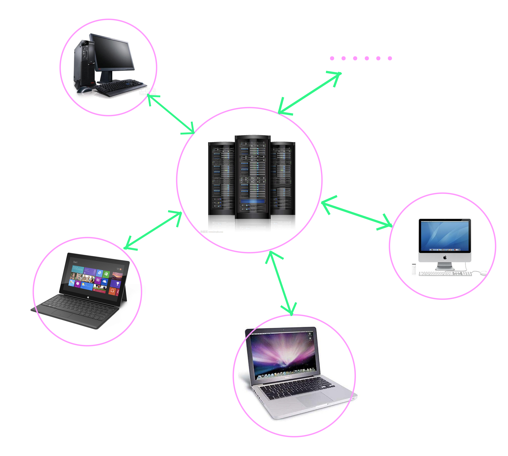
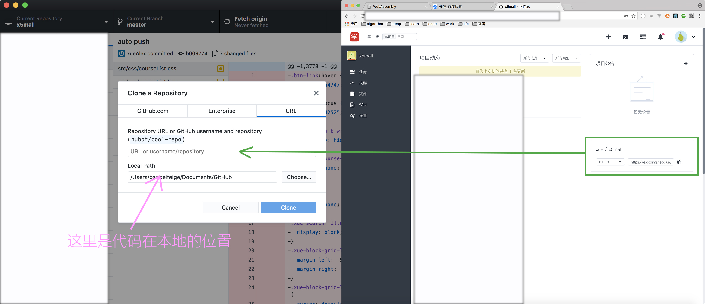
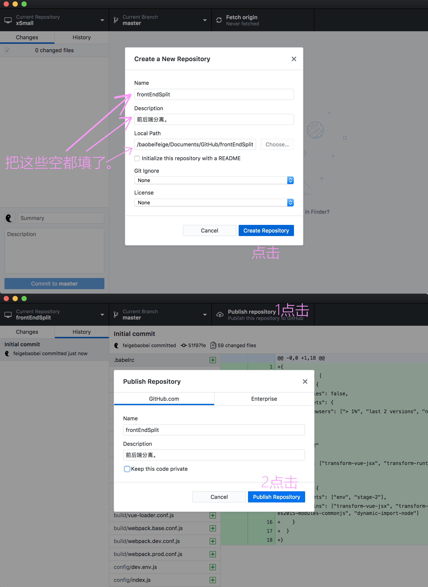

#githubDesktop
为了方便团队开发。很多团队领导会选择svn,github,coding……。这样就需要用到git。同学们可以使用git的命令行，也可以使用git的可视化工具————github Desktop。本质上讲两者无区别。  
这篇文章介绍github desktop的使用。  

###first 原理
  
每个个体都有其最后一次同步项目后的全部代码。个体通过githup desktop上传各自修改、完成的部分。其他个体通过github desktop下载这部分代码。代码存在于每个个体端和远程端上。  
github desktop就是连接个体端和远程端的桥梁。负责上传、下载（就是同步）代码。  

###second 使用

1. 代码在远程，本地无。  
      
1. 代码在本地。远程无。  
    

---
2018/03/16 by stone