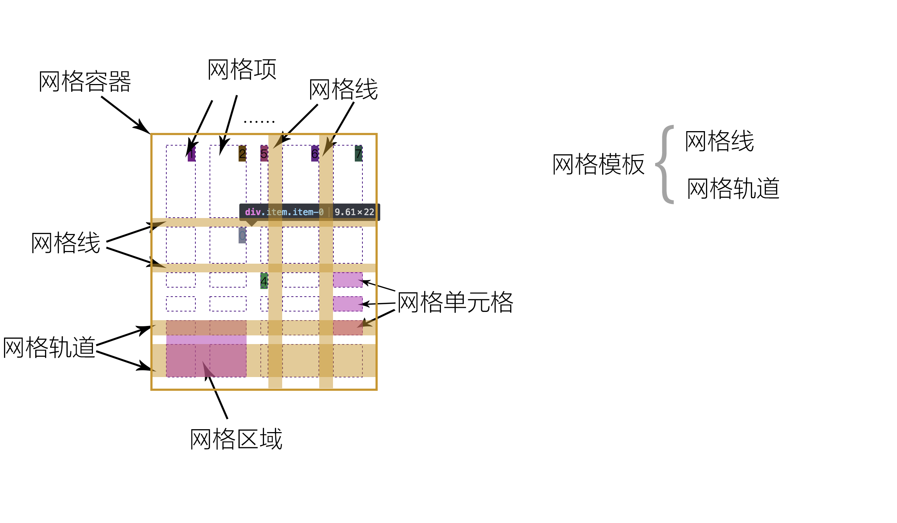
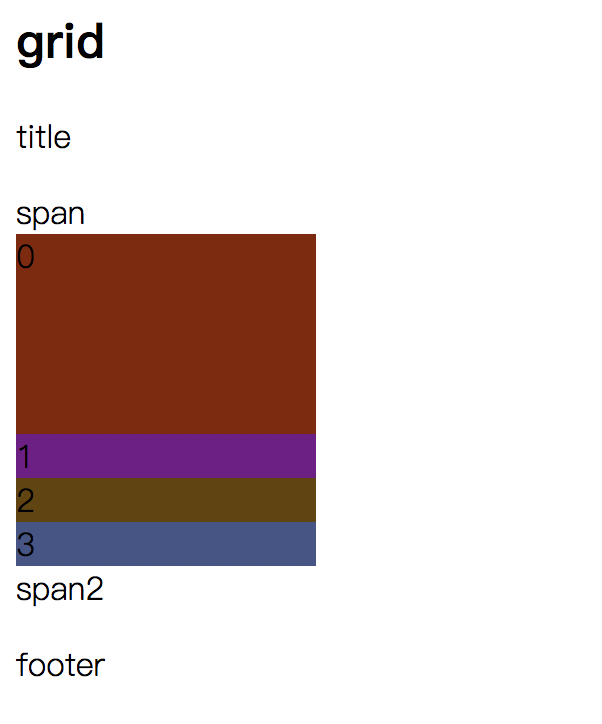
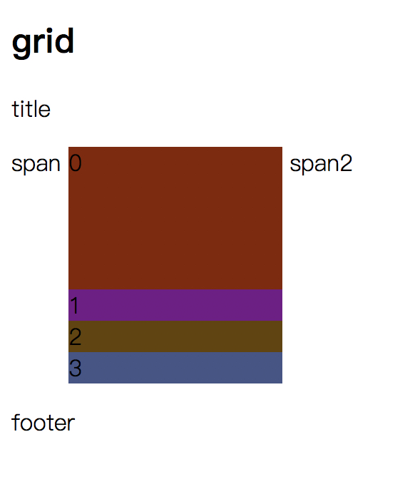

#网格布局
|grid|flex|
|-|-|
|布局方式是二维布局|布局方式是一维布局|
|较适用于大规模布局|较适用于小规模布局|

用到的概念：网格容器，网格项，网格线，网轨道，网格单元格，网格区域，网格模板。  
  

|grid|-|12|
|grid|-|12|
|grid|-|12|  

使用grid布局需要在2个地方设置样式：网格容器，网格项。  
**网格容器**  
display: grid|inline-grid;  
  
  
grid-template-rows: [gap-name] <track-size\> [gap-name2] <track-size\> [gap-name3];  
grid-template-columns: [gap-name] <track-size\> [gap-name2] <track-size\> [gap-name3];  
grid-template-areas: '<grid-area-name\> | . | ...' '. . . .';  

| | |
|-|-|
|.|表示一个空单元格|
|<grid-area-name\>|使用grid-area属性定义网格区域的名称|
|none|无网格区域被定义|

grid-column-gap/grid-row-gap  

    grid-column-gap: 100px 50px 30px;

grid-gap: <grid-column-gap\> <grid-row-gap\>  

justify-items: start|center|end|stretch;//每个单元格内的对齐方式
align-items: start|center|end|strech;
justify-content: start|center|end|stretch|space-around|space-between|space-evenly;//整个网格容器内的内容的对齐方式  
align-content: start|center|end|stretch|space-around|space-between|space-evenly;  
grid-auto-column/grid-auto-rows//定义自动生成的网格轨道。具体的我也不会。  
grid-auto-flex//不会。   
grid//简写。  

    .container{
        grid-template-columns: [first] 40px [line2] 50px [line3] auto [col4-start] 50px [five] 40px [end];
        grid-template-rows: [row1-start] 25% [row1-end] 100% [third-line] auto [last-line];
    }

**网格项**  
网格容器，网格项，网格线，网轨道，网格单元格，网格区域，网格模板。  
grid-column-start/grid-column-end/grid-row-start/grid-row-end//使用它们确定网格区域。  

    .item-a{
        grid-column-start: 2;
        grid-column-end: five;
        grid-row-start: row1-start
        grid-row-end: 3
    }

grid-column: <start-line\> <end-line\>  
grid-row: <start-line\> <end-line\>  
grid-area: <name\> | <row-start\> / <column-start\> / <row-end\> / <column-end\>;  

    .class {
        grid-area: name;
    }
    .class2 {
        grid-area: 1 / col-name1 / row-name2 / 6;
    }

单元格内的对齐方式  

justify-self: start|center|end|stretch;  
algin-self: start|center|end|stretch;  

--- 
2018/02/23 by stone