#hardware
  

主要部件  

|不要缼|可有可无|
|-|-|
|主板||
|cpu||
|内存||
|硬盘||
|显卡||
|声卡||
|网卡||
|光驱||
|电源||
||机箱|
||蓝牙|
||1494卡|
||视频采集卡|
||电视卡|

###主板  
各种信息交流的中心，担负着保障系统稳定运行的责任。  
会影响到整个电脑系统的性能和稳定性。  
  

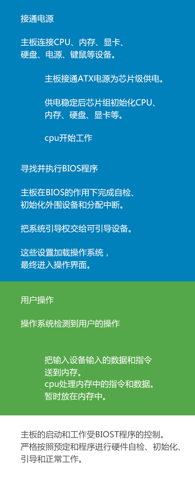

cpu接口类型->LGA***（触点式。数字表示触点的数量。）  

主板分类（结构）  

|名称|性能||
|-|-|-|
|ATX|||
|MATX|体积小，适合小主机。散热差。||
|BTX|窄板设计。散热好。安装简便。||

主要性能指标  

|||
|-|-|
|内存的支持类型||
|cpu的支持类型||
|前端总线频率|cpu通过前端总线连接到北桥芯片。然后连接显卡、内存、数据传输。|
|cpu的温度检测||
|BIOS技术||

主板的各接口  
  

||||
|-|-|-|
|cpu插槽|主要有LGA775/LGA1151/LGA1366……||
|内存插槽|相同颜色的可以组成双通道||
|SATA接口|||
|IDE（电子集成驱动器）插槽|一般有40针||
|PCI Express 插槽|||
|PCI插槽|显卡、声卡、网卡……||
|电源接口|24芯（20芯的不多见了）。还有cpu电源接口、PCI电源接口。||
|PS/2接口|不支持热插拔||
|USB接口|1.0/1.1/2.0/3.0等。只有主板、数据线、设备同时采用3.0才能发挥最佳性能。|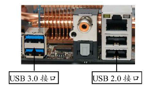|
|E-SATA接口|外置SATA接口||
|VUA(Video Graphics Array)/DVI(Digital Visual Interface/HEMI(High-Definition Multimedia Interface)|||
|机箱前置面板针脚|||
|其他接口||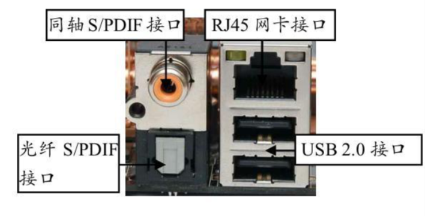|

主板上的无器件  

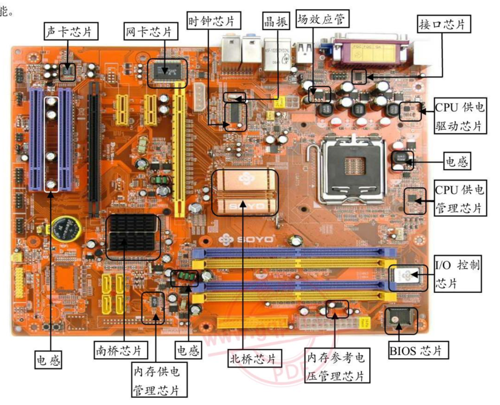

|名称|说明|图片|
|-|-|-|
|芯片组（北桥芯片、南桥芯片）|北桥负责与cpu的联系，控制内存、PCI-E、PCI的数据传输。南桥负责联系低速设备和输入输出设备||
|BIOS芯片|为计算机提供最低级的、最直接的控制。||
|CPU供电模块|一般包括（电容、电厂线圈、MOSFET管、驱动芯片）|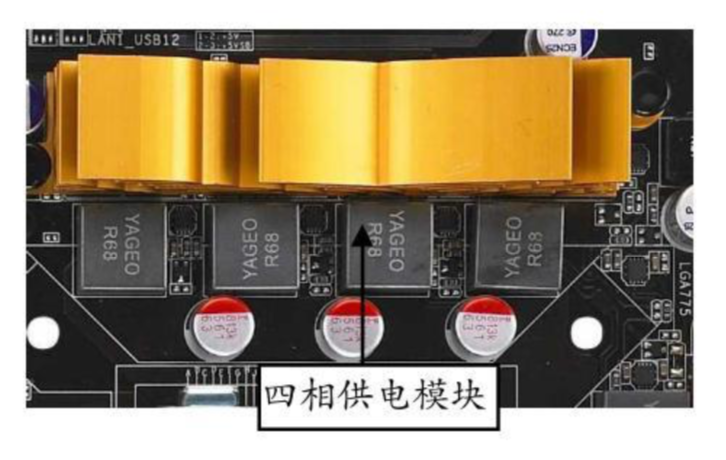|
|板载显卡|兼容性好、运行稳定、性能偏低。有的主板添加了的集成显存，这使得板载显卡的性能可能比部分独立显卡都要好。|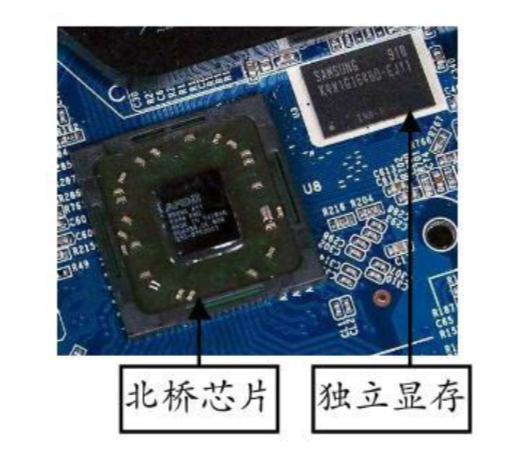|
|板载声卡|可分为软声卡、硬声卡。硬声卡有DSP芯片不需要CPU参与||
|CMOS电池|为CMOS存储器供电|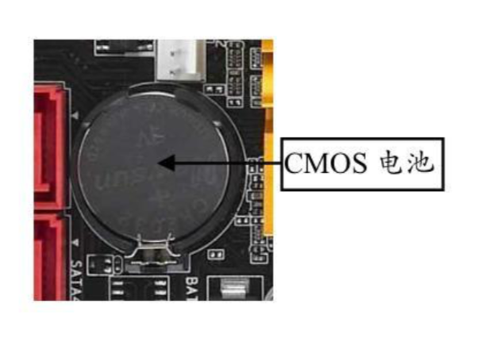|
|时钟芯片|数据传送时同步时钟|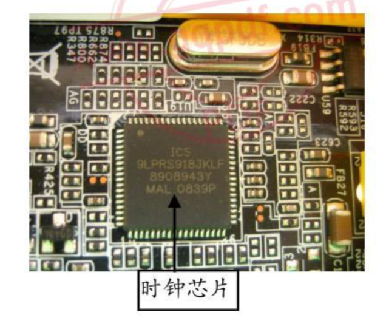|
|IO控制芯片||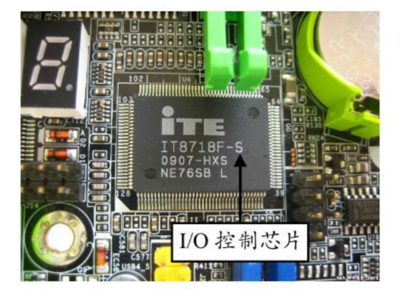|
|IDE芯片|||
|RAID芯片|||  

主板质量分析  

||||
|-|-|-|
|性能|||
|做工|||
|用料|各部分用不同颜色区分。封闭式电感好。|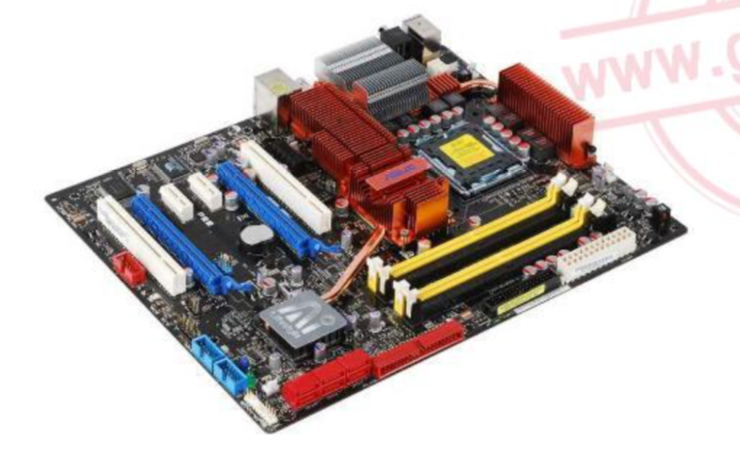|
||||
||||
||||
||||
||||  

###cpu  

cpu的结构  
  

|名称|说明|图片|
|-|-|-|
|控制器|电脑的控制中心||
|运算器|由自述/逻辑单元和寄存器组成||
|存储器|||
|内部总线||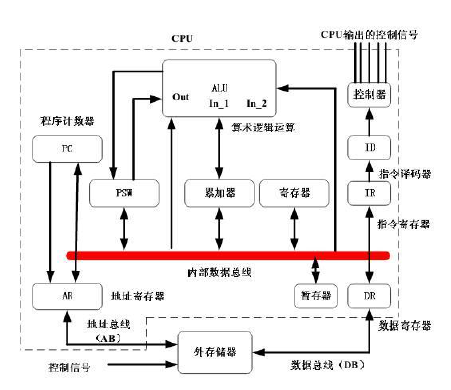|  

cpu的工作原理  

|名称|说明|图片|
|-|-|-|
|提取|从内存、缓存中读取指令。||
|解码|指令被拆解为有意义的片断||
|执行|执行解码后的指令||
|写回|把运算结果写进cpu的寄存器。||  

cpu性能指标  

|||
|-|-|
|主频|cpu运算、处理数据的速率|
|缓存||
|扩展指令集||
|工作电压||
|制造工艺||
|内存总线速度||
|cpu插座||
|||
|||
|||
|频率|实际频率=外频*倍频|
|多内核|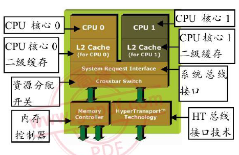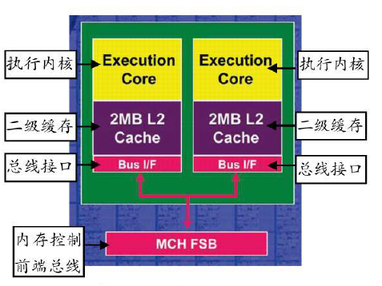|
|缓存|可有多级缓存。|
|位与字长||
|前端总线|数据带宽=（前端总线频率*数据位宽）/8|
|封装技术||
|多线程||
|核心电压||
|指令集||  

cpu散热技术  

||||
|-|-|-|
|风冷法|（下吹式，侧吹式）||
|液冷法|||
|半导体至冷法|||
|热管散热|||
|其他散热|||
||||  

cpu编号识别  

||||
|-|-|-|
|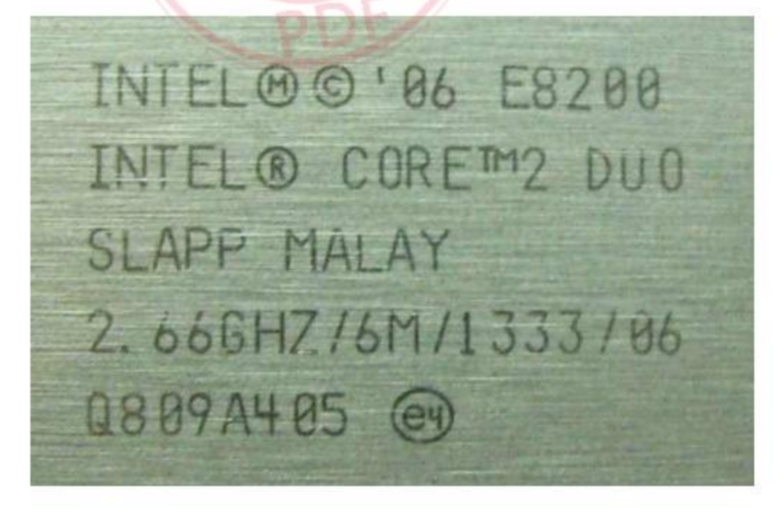|第一行。  TDP（热设计功耗）QX 超过50W > T 25w-49w > L 15w-24w U 低于14w 。在前缀字母相同时4位数字越大质量越好。||
||第二行。  酷睿2。||
||第三行。  SLAPP：S-Spec编号。 之后是封装地信息。MALAY马来西亚CHINA中国COSA RICA哥斯达黎加||
||第四行。  主频：2.66GHz。二级缓存：6m, 前端总线频率1333MHz, 步进||
||第五行。  产品的序列号||
|AMD Athlon64 X2 BE-2350|BE-2350, 第一个字母表示市场定位。G：高端，B：中端，L：入门。第二个字母表示TDP范围。E：小于65w。P：大于65w。S：大约65w。后面的数字表示产品家庭。1000：Sempron/Athon单核心。2000、6000：Athon双核心。8000：Phenom三核心。9000：Phenom四核心||
|cpu核心上的编码。一般的4行。|||
||||
||||
||||  

|||
|||
|||
|||
|||
|||

