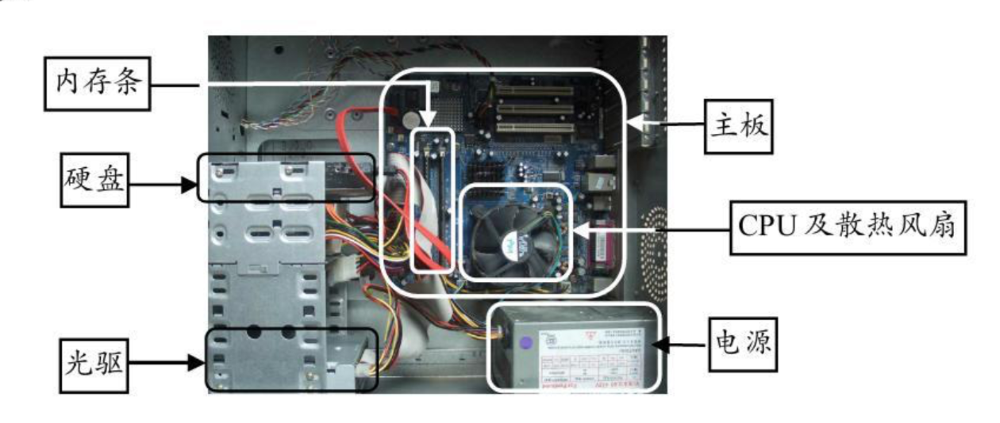
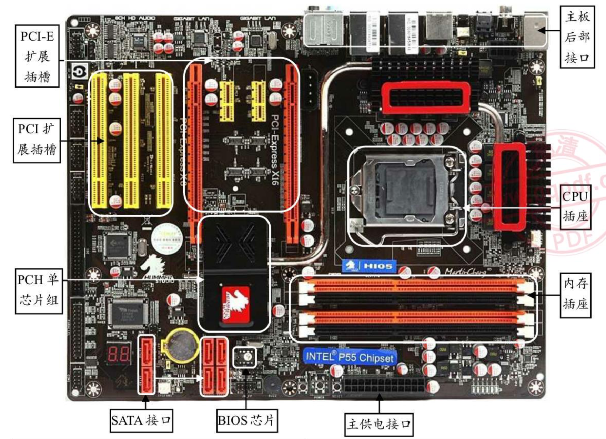
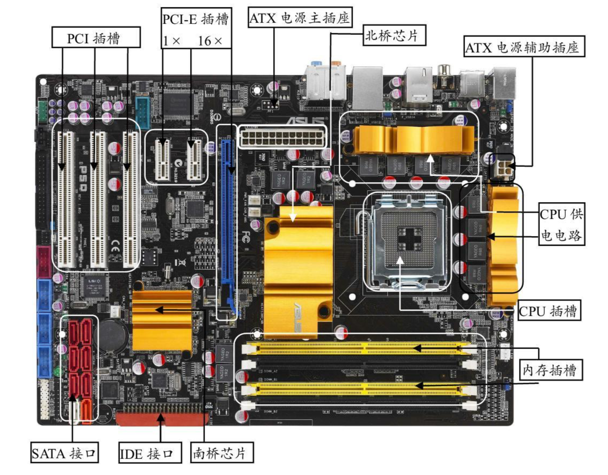
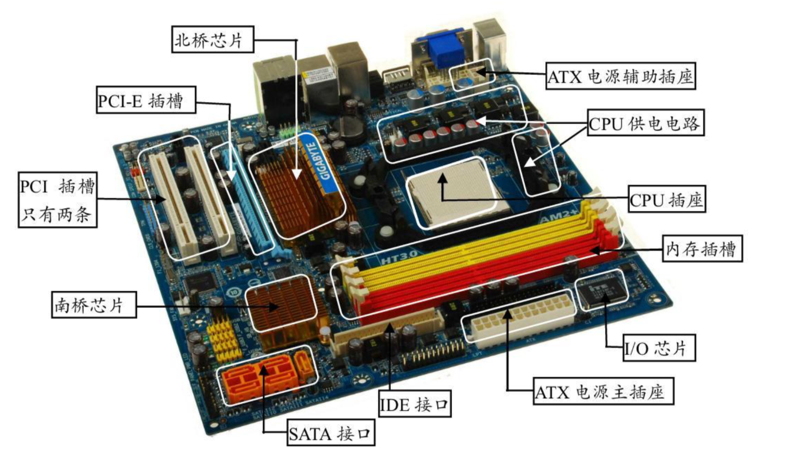
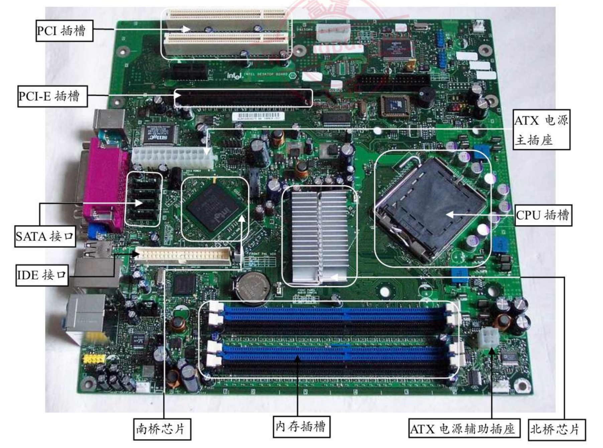
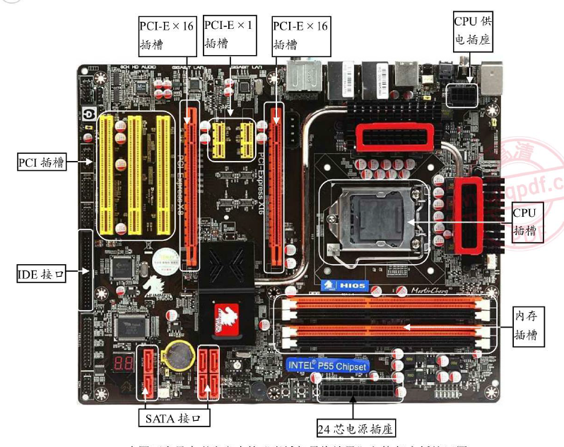
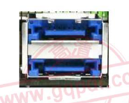
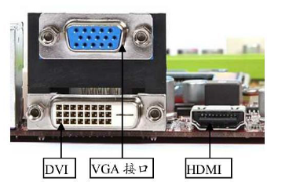

#hardware
  

主要部件  

|不要缼|可有可无|
|-|-|
|主板||
|cpu||
|内存||
|硬盘||
|显卡||
|声卡||
|网卡||
|光驱||
|电源||
||机箱|
||蓝牙|
||1494卡|
||视频采集卡|
||电视卡|

####主板
各种信息交流的中心，担负着保障系统稳定运行的责任。  
会影响到整个电脑系统的性能和稳定性。  
  

cpu接口类型->LGA***（触点式。数字表示触点的数量。）  

主板分类（结构）  

|名称|性能||
|-|-|-|
|ATX|||
|MATX|体积小，适合小主机。散热差。||
|BTX|窄板设计。散热好。安装简便。||

主要性能指标  

|||
|-|-|
|内存的支持类型||
|cpu的支持类型||
|前端总线频率|cpu通过前端总线连接到北桥芯片。然后连接显卡、内存、数据传输。|
|cpu的温度检测||
|BIOS技术||

主板的各接口  
  

||||
|-|-|-|
|cpu插槽|主要有LGA775/LGA1151/LGA1366……||
|内存插槽|相同颜色的可以组成双通道||
|SATA接口|||
|IDE（电子集成驱动器）插槽|一般有40针||
|PCI Express 插槽|||
|PCI插槽|显卡、声卡、网卡……||
|电源接口|24芯（20芯的不多见了）。还有cpu电源接口、PCI电源接口。||
|PS/2接口|不支持热插拔||
|USB接口|1.0/1.1/2.0/3.0等。只有主板、数据线、设备同时采用3.0才能发挥最佳性能。||
|E-SATA接口|外置SATA接口||
|VUA(Video Graphics Array)/DVI(Digital Visual Interface/HEMI(High-Definition Multimedia Interface)|||
||||
||||
||||
||||  

cpu性能指标  

|||
|-|-|
|频率|实际频率=外频*倍频|
|多内核||
|缓存|可有多级缓存。|
|位与字长||
|前端总线|数据带宽=（前端总线频率*数据位宽）/8|
|制造工艺||
|封装技术||
|多线程||
|核心电压||
|指令集||
|||
|||
|||
|||
|||
|||
|||
|||
|||
|||
|||
|||
|||
|||
|||
|||
|||

队列第一期的前端部分有8个页面已经全部完成。  
1. 韩博丞负责做《kafka-topic》、《vhost详情》。  
2. 田片做了《kafka集群》（这个页面的前后端都是他写的。）  
3. 我做了《队列审核》、《vhost审核》、《topic审核》、《数据转移》、《队列操作日志》。帮助后端在添加php页面的动态数据。  

配合后端做队列二期。  

因为这个项目采用前后端不分离的方式开发，所以后端的工作比较重些。上周写完蛋静态页面就一直等着后端的接口。这周试着帮后端添加动态数据。学会以了从数据库中单表查询数据后通过mvc显示在视图层。下周学习增改查删，帮助后端多做些事，项目快点上线。
