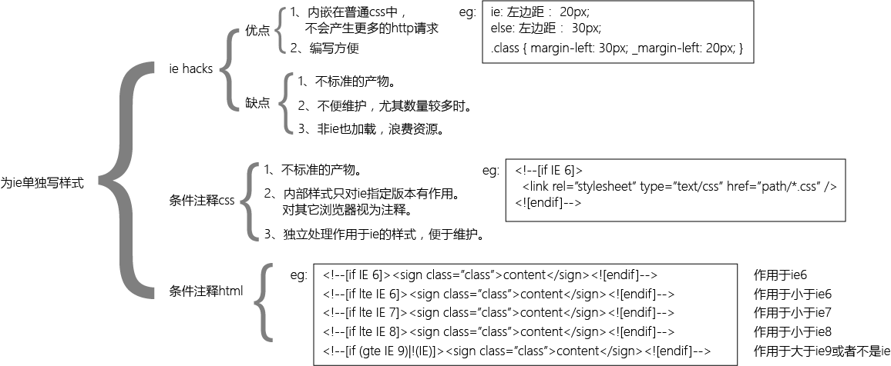

#ie的兼容问题
这里总结了我的平时工作、学习中遇到的ie兼容问题。  

- 高版本jq不支持ie低版本。
- ie不支持html新标签
- ie不支持css新标签
- 360兼容模式使用ie内核，极速模式使用webkit内核。
- onchange,onkeyup,onkeypress,onkeydown

##ie的处理方法

|windown.navigate|window.location.href|
|-|-|
|只针对ie|兼容所有浏览器|
|都是实现页面跳转的方法|都是实现页面跳转的方法|
