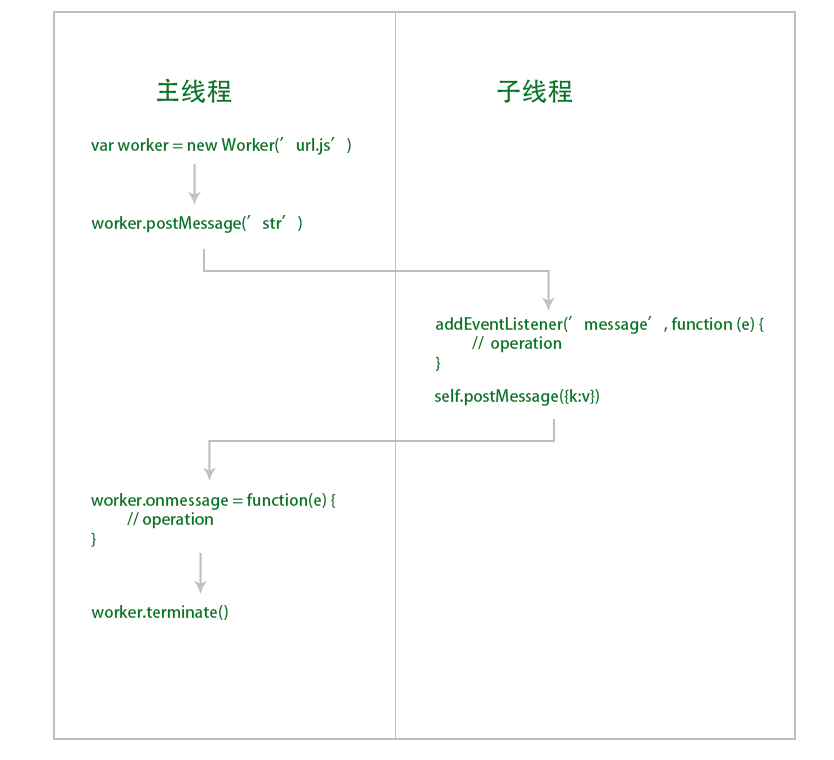

#worker

在前端实现多线程工作。  

##使用分析

  

##api

###主线程

    let worker = new Worker('url.js', options)
    worker.postMessage('str') // 向子线程发送消息
    worker.onmessage(function (event) {
        // event.data 从子线程传来的数据
    })
    worker.addEventListener('message', function (event) {})
    worker.onerror(function (event) {}) // 当子线程错误时
    worker.addEventListener('error', function (event) {})
    worker.terminate() // 关闭子线程

###子线程

    self是子线程的全局对象
    self.addEventListener('message', function (event) {
        // event.data 是从父线程传来的数据
    })
    self.onmessage = function (event) {}
    self.onmessageerror = function (event) {} // 当发送的数据无法序列化时触发。
    self.postMessage(obj) // 向父线程传数据
    self.close() // 关闭当前子线程

##限制

1. 必须使用同源文件。  
2. 不能操作主线程的内容。  
3. 子主线程间必须使用message传递数据。  
4. 不能执行打断主线程的代码。  
5. 必须来自网络不能使用本地文件。  

##建议

1. 在主线程中创建的子线程。尽量在主线程中关闭子线程。  
2. 使用同页面的web worker.  

```
    <script id="workId" type="app/worker">
        ...
    </script>

    // other
    let blob = new Blob([document.querySelector('#workId').textContent])
    let url = window.URL.createObjectURL(blob)
    let worker = new Worker(url)
```

---
2018/12/07 by stone
