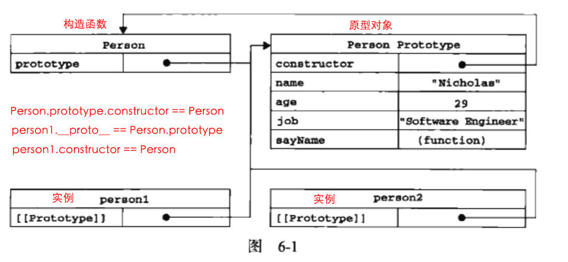

## object对象 function对象  

## 构造函数  

    function Person (name, age, job) {
        this.name = name
        this.age = age
        this.job = job
        this.sayName = () => { console.log(this.name) }
    }

    var p1 = new Person('tom', 23, 'enginner')
    p1.constructor === Person // true
    // p1的构造函数是Person

## 原型对象  

每个函数都有一个`prototype`属性，指向原型对象。  

每个对象都有`__proto__`属性。但只有函数对象才有`prototype`属性。  

|`prototype`|`__proto__`|
|-|-|
|||
|||  

原型对象有一个默认的属性`constructor`，指向`prototype`属性所在的函数。  

    p1.constructor === Person
    Person.prototype.constructor === Person

原型对象是构造函数的一个实例，原来如下。  

    var A = new Person()
    Person.prototype = A

## __proto__  

指向创建它的构造函数的原型对象。  

    p1.__proto__ === Person.prototype          // 实例的__proto__属性指向原型对象。
    p1.constructor === Person                  // 实例的构造器属性指向构造函数
    Person.prototype.constructor === Person    // 原型对象的构造器指向构造函数，因为p1与原型对象都是构造函数的实例。

  

## 构造器  

就是实例的构造函数。  

## 原型链  

    function F() {}
    var a = new F()

    a.__proto__ === F.prototype // 实例的__proto__指向构造函数的原型
    F.prototype.__proto__ === Object.prototype // 构造函数的原型是普通对象
    Object.prototype.__proto__ === null // null处于原型链的顶端

