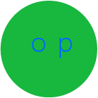
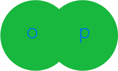
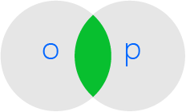
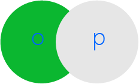

#javascript权威指南 笔记

    obj['name']
    obj.name

"use strict"   
在 es3 中不确定的行为得到处理。  
##3
bool, string, digit, array, function, null, undefined, date, regexp, error.  
最大值：+-1.797*E308, 最小值：+-5*E-324.  
16进制： oxff // 15 * 16 + 15 = 255(十进制)  
10进制：
8进制：0377 // 3 * 64 + 7 * 8 + 7 = 255(十进制)  
在es6的严格模式下，8进制是明令禁止的。  
2进制：  

`+-*/%`  

Math对象的属性  

    Math.pow(2, 53); // 2的53次方
    Math.round(0.6); // 1.0, 四舍五入
    Math.ceil(0.6); // 1.0, 向上求整
    Math.floor(0.6); // 0.0, 向下求整
    Math.abs(-5); // -5的绝对植
    Math.min(x, y, z); // 返回最小值
    Math.max(x, y, z); // 返回最大值
    Math.random(); // 返回0<=x<1.0的伪随机数
    Math.PI; // 圆周率
    Math.E; // 自然对数的底数
    Math.sqrt(3); // 3的平方根
    Math.pow(3, 1/3); // 3的立方根
    Math.sin(0); // sin0的值
    Math.cos(0); // cos0
    Math.tan(0); // tan0
    Math.log(10); // 10的自然对数
    Math.log(100)/Math.LN10; // 以10为底100的对数
    Math.log(512)/Math.LN2; // 以2为底512的对数
    Math.exp(3); // e的三次幂

`Infinity`  

string对象的属性  

    str.charAt(0); // 
    str.charAt(str.length - 1); // 
    str.substring(start, end); // 
    str.slice(start, [end]); // 
    str.indexOf('substr'); // 
    str.lastIndexOf('substr'); // 
    str.indexOf('substr', 3); // 
    str.split(','); // 
    str.replace('substr1', 'substr2'); // 
    str.toUpperCase(); // 
    str[0]; // 
    str[str.length - 1]; // 最后一个字符

null 非对象  
undefined 没有初始化  

|||||
|-|-|-|-|
|null|无值|非对象|== true|
|undefined|无值|没有初始化|=== false|

|值|转换为字串|转换为数字|转换为bool值|转换为对象|
|-|-|-|-|-|
|undefined|"undefined"|NaN|false|throws TypeError|
|null|"null"|0|false|throws TypeError|
|true|"true"|1|`-`|new Boolean(true)|
|false|"false"|0|`-`|new Boolean(false)|
|`""`|`-`|0|false|new String('')|
|`1.2`|`-`|1.2|true|new String("1.2")|
|`"one"`|`-`|NaN|true|new String('one')|
|0|`"0"`|`-`|false|new Number(0)|
|-0|`"0"`|`-`|false|new Number(-0)|
|NaN|`"NaN"`|`-`|false|new Number(NaN)|
|Infinity|`'Infinity'`|`-`|true|new Number(Infinity)|
|-Infinity|`'Infinity'`|`-`|true|new Number(-Infinity)|
|1|`"1"`|`-`|true|new Number(1)|
|`{}`|||true|`-`|
|`[]`|`""`|0|true||
|`[9]`|`"9"`|9|true||
|`["a"]`|`"a"`|NaN|true||
|`function () {}`||NaN|true||

显示类型转换  

    Number("3")
    String(false)
    Boolean([])
    Object(3) // new Number(3)
    number.toString(radix) // 转换为字符串
    number.toFixed(num)
    number.toExponential(num)
    number.toPrecision(num)
    parseInt("21345")
    parseFloat("string")

||||
|-|-|-|
|声明|`var variable`|被提前到顶部|
|定义|`var variable = 1`|不会被提前|

ajax  
图像ping  
jsonp  
comet  
web socket  

    var point = {x: 1, y: 2}
    "x" in point // true
    "z" in point // false

    instanceof
    typeof

    eval()
    // 在严格模式下。可以更改局部变量，不能在局部作用域内定义新的变量或函数。

多次声明同一个变量无所谓。  

break  
continue  
return  

    throw new Error('string')

    try {
        // 抛出一个异常
    }
    catch(e) {
        // 捕获异常时执行
    }
    finally {
        // 永远会执行
    }

严格模式下禁止使用with语句。非严格模式下不推荐使用with。原因难于人优化，运行慢。  
debugger // 加断点  
"use strict"  

|严格模式|非严格模式|
|-|-|
|禁止使用with|可以使用|
|使用变量、函数、参数……必须先声明|可以不声明|
|调用的函数（不是方法）中的this是undefined|this是全局对象|
|call(), apply() 中的this是传入的第一个参数||
|给只读属性赋值和给不可扩展对象创建新成员时会抛出类型错误。|显示操作失败，只报错。|

对象object  
    
    var book = {
        "main title": 'js', // 属性名字中有空格，必须用字符串表示。  
        'sut-title': 'object', // 属性名字中有连字符，必须用字符串表示。
        'for': 'student', // for是保留字，必须用字符串表示。
        author: { // 这个属性名字可以不加引号。
            firstname: 'david',
            surname: 'flanagan'
        }
    }

创建一个对象  

    var a = new Array();
    var d = new Date();
    var r = new RegExp('js');

    Object.create() // 是一个静态函数。
    var o = Object.create(null)

    // 通过原型继承一个新对象
    function inherit(proto) {
        if (proto == null ) throw TypeError()
        if (Object.create) return Objcet.create(proto)
        var t = typeof proto
        if (t !== 'object' && t !== 'function') throw TypeError();
        var F = function () {}
        F.prototype = proto
        return new F()
    }

delete 只能删除自在属性，不能删除继承属性。  
严格模式下不能删除全局属性、方法。  

    o.hasOwnPreperty(name) // 是否是自有属性
    o.propertyIsEnumerable(name) // 是否可枚举

    // o继承p中的全部属性、方法
    function extend(o, p) {
        for (prop in p) {
            o[prop] = p[prop]
        }
        return o
    }
  
***

    // o合并p中的全部属性、方法。并集
    function merge(o, p) {
        for (prop in p) {
            if (o.hasOwnPorperty[prop]) continue
            o[prop] = p[prop]
        }
        return o
    }
  
***

    // 从o中减去p中没有的属性、方法。交集。
    function restrict(o, p) {
        for (prop in p) {
            if (!(prop in p)) {
                delete o[prop]
            }
        }
        return o
    }
  
***

    // 从o中减去p中全部的属性、方法。
    function subtract(o, p) {
        for (prop in p) {
            delete o[prop]
        }
        return o
    }
  
***

    // 
    function union(o, p) {
        return extend(extend({}, o), p)
    }

    // 
    function intersection(o, p) {
        return restrict(extend({}, o), p)
    }

    // 
    function keys(o) {
        if (typeof o !== 'object') throw TypeError()
        var temp = []
        for (var prop in p) {
            if (o.hasOwnProperty(prop)) temp.push(porp)
        }
        return temp
    }

    Object.getPrototypeOf(o) // 得到o对象的原型。
    o.constructor.prototype // 得到o对象的原型
    p.isPrototypeOf(o) // p是否是o的原型

`__proto__`用来直接查询、设置对象原型。但不推荐使用。因为safari/chrome支持。ie,opera不支持。ff虽然支持，但是限制修改不可扩展对象的原型  

可扩展性  

    Object.preventExtensions(o) // 设置o为不可扩展对象。设置为不可扩展对象后不能再回到可扩展对象。若为不可对象扩展属性。虽不会报错，但没有执行结果。
    Object.seal(o) // 封印o对象。不仅不能扩展对象，而且还不能删除它已有的属性。
    Object.isSealed(o) // 检测是否封印。
    Object.freeze(o) // 冻结对象。不可修改。
    Object.isFrozen(o) // 是否冻结

序列化对象  

    JSON.stringify(o)
    JSON.parse(s)

