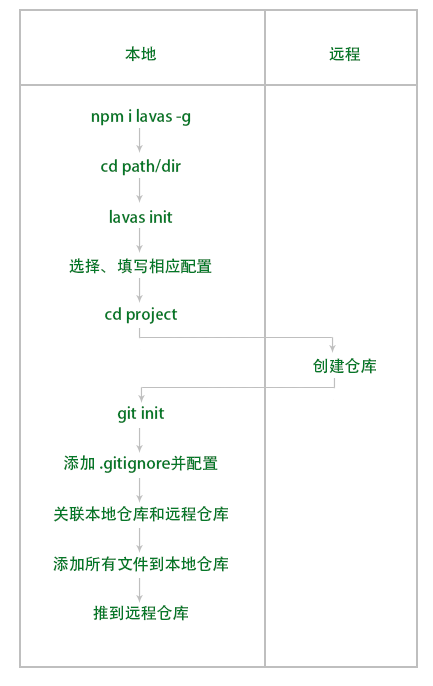

#lavas

一个百度做的基于vue的pwa框架。  

##prepare

  

##基本结构

###assets/static

都是存放外部静态资源。  
/assets里的内容会被 webpack 构建到生成目录的文件中，不再会单独以文件形式存在。因此 iconfont 放置在 /assets 中。  
/static里的内容会被原样复制到生成目录中，会以独立的文件形式存在。因此 PWA 用到的 manifest.json 和一系列图标等都放置在 /static 中。  

###components

存放vue组件。  

###core

散落但必须的文件。一般是脚本框架。  

###middlewares

用户自定义的中间件。  

###pages  

每个页面的vue组件。  
在这里的每一个vue文件都会生成一个路由。  
生成的路由是首字母小写中间的大小写不变。
index.vue是默认页面级组件。    
`/pages/Index.vue` => `/`  
目录小写组件大写开头。  

###lavas.config.js

lavas项目的配置文件。里有5块内容。  

||||
|-|-|-|
|build|||
|errorHandler|||
|middleware|||
|router|||
|serviceWorker|||

###store

这个目录下放置vuex。每一个模块都必须是一个完整的模块。即必须包含：state/getters/mutations/actions.  

###动态参数

    this.$route.param.id

###嵌套路由

在同级目录下创建2vue文件。一个是首字母大写的文件做的嵌套路由的父组件。另一个是首字母小写的目录做为嵌套路由的子组件的集合。它内容是各个子组件。这些子组件首字母请用大写。  

    page
    |--First.vue
    |--first
       |--Second.vue
       |--Three.vue

    // First.vue
    <template>
        ...
        <router-view></router-view>
    </template>
    // 其它vue就与正常开发无区别。

###store

    export const state = () => {
        return {...}
    }
    export const mutations = () => {
            ...
    }
    export const actions = () => {
            ...
    }

###lavas.config.js  

配置文件。主要有5部分组成。  

- build 构建相关(webpack相关)。  
- error 错误处理相关。  
- middleware 中间件相关。  
- router 路由规则相关。  
- serviceWorker Service Worker 相关。  

####build

#####ssr

使用单页面应用还是使用ssr（服务端渲染）  

#####path

构建产物的输出目录。必须是绝对路径。

#####
#####
#####
#####
#####
#####
#####
#####

###.lavas

一旦lavas项目运行过一次，就会生成一个`/.lavas`目录。  
这里有路由规则，处理热更新。  
应处理为`/.gitignore`  

###动态参数

用于响应动态参数的vue文件发现使用`_`开关。其后的内容是动态路由的参数。这个文件中使用`this.$route.param.key`得到动态参数。  

##命令

###lavas init // 项目初始化
###lavas build // 构建项目,生成到/dist目录中
###lavas dev // 使用lavas内置的服务器启动项目.一般用于开发.
###lavas start // 使用lavas内置的服务器启动服务端渲染项目
###lavas static // 以当前目录为基准启动lavas内置服务器  

---

2018/12/13 by stone