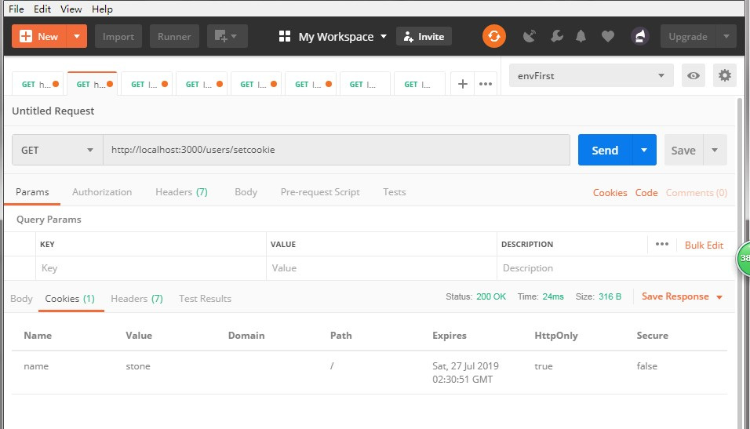
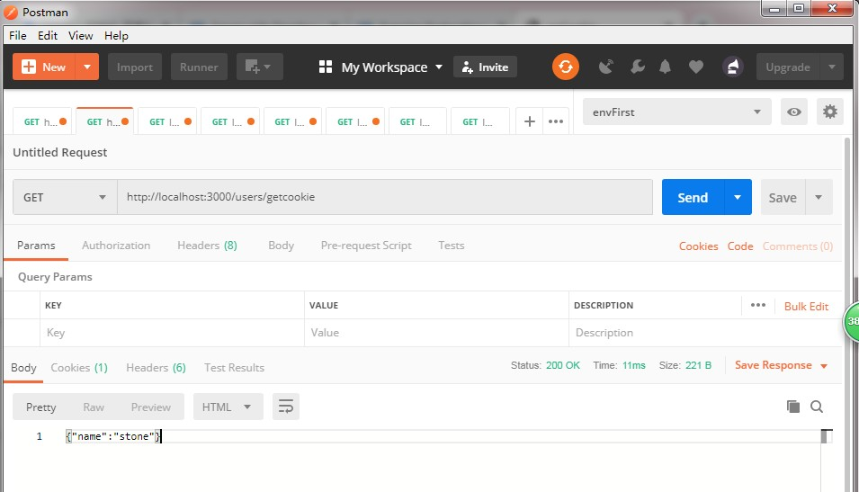
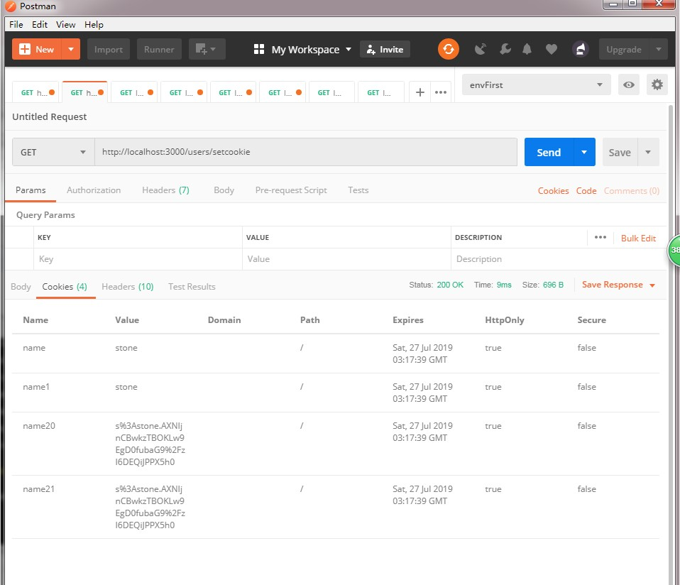
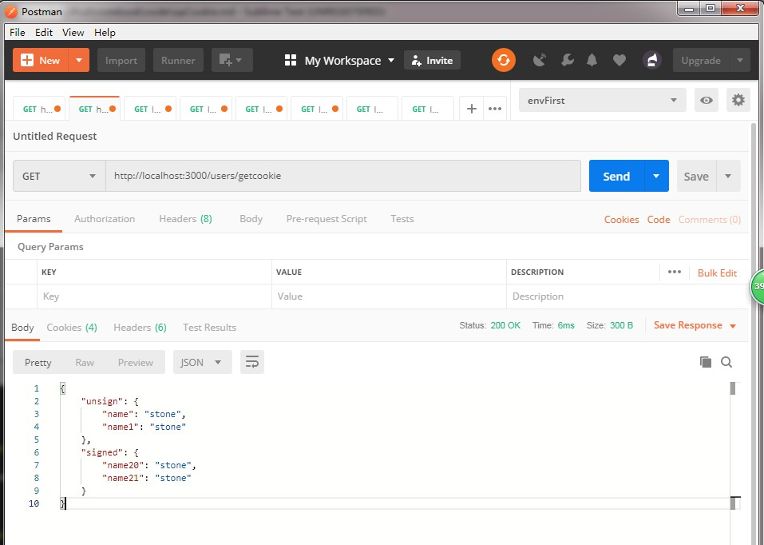

# 在express项目中设置、得到cookie。

##1. 新建一个express项目。

    express node-cookie

## 2. 安装依赖。

    cd node-cookie
    npm i

因cookie-parser是express框架内置的，所有不用再手动安装了。

## 3. 设置cookie.

在`./routes/users.js`文件里新建一个路由`/setcookie`，并在该路由内设置路由。也可以设置多个cookie，得到cookie时也就是多个。

    router.get('/setcookie', (req, res, next) => {
      res.cookie('name', 'stone', {maxAge: 6000, httpOnly: true})
      res.send('success for set up')
    })

## 4. 得到cookie.

一旦cookie设置成功后，前端与后端通信时会在请求头里带上cookie.后端使用`req.cookies`得到。

    router.get('/getcookie', (req, res, next) => {
      res.send(JSON.stringify(req.cookies)) // {"name":"stone"}
    })

## 5. 设置签名cookie

在no.3步设置的cookie明文。若需要签名，则可以使用`cookie-parser`模块的`signed: true`属性。

    // app.js
    app.use(cookieParser('secrete')) // 其参数用于加签名、解签名时。
    // 测试一下加密、解密功能。
    // ./routes/users.js
    router.get('/setcookie', (req, res, next) => {
      res.cookie('name', 'stone', {maxAge: 60000, httpOnly: true})
      res.cookie('name1', 'stone', {maxAge: 60000, httpOnly: true})
      res.cookie('name20', 'stone', {maxAge: 60000, httpOnly: true, signed: true})
      res.cookie('name21', 'stone', {maxAge: 60000, httpOnly: true, signed: true})
      res.send('success for set up')
    })

## 6. 得到签名cookie

    // ./routes/users.js
    router.get('/getcookie', (req, res, next) => {
      let o = {
        unsign: req.cookies,
        signed: req.signedCookies
      }
      res.json(o)
    })

## 7. 说说cookie-parser。

设置cookie时使用的`res.cookie`的第三个参数是cookie的限制属性。

cookie-parser 是一个解析/设置cookie的模块。在express框架使用需要凭借以下代码。

    var express = require('express')
    var cookieParser = require('cookie-parser')
    var app = express()
    app.use(cookieParser('signText')) // 若使用签名必须设置secret string,
    // app.use(cookieParser()) // 这是不使用签名的。

这里有我翻译的[cookie-parser]()的文档。

## 8. 日后项目改进。

因cookie会保存在client，所以最好不保存敏感信息。
因有些浏览器对cookie大小、数量有限制，所以不能设置太多cookie.
因此会使用cookie保存session ID 的方式解决以上2个缺点。
