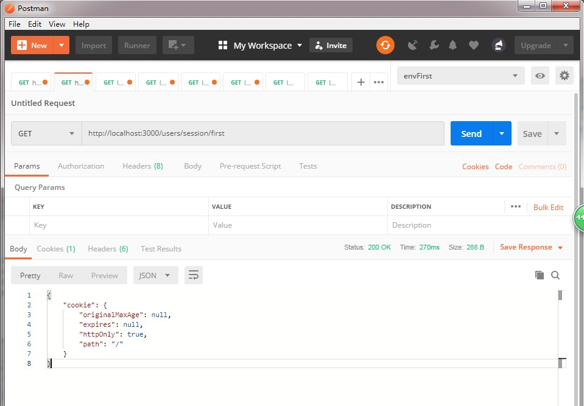
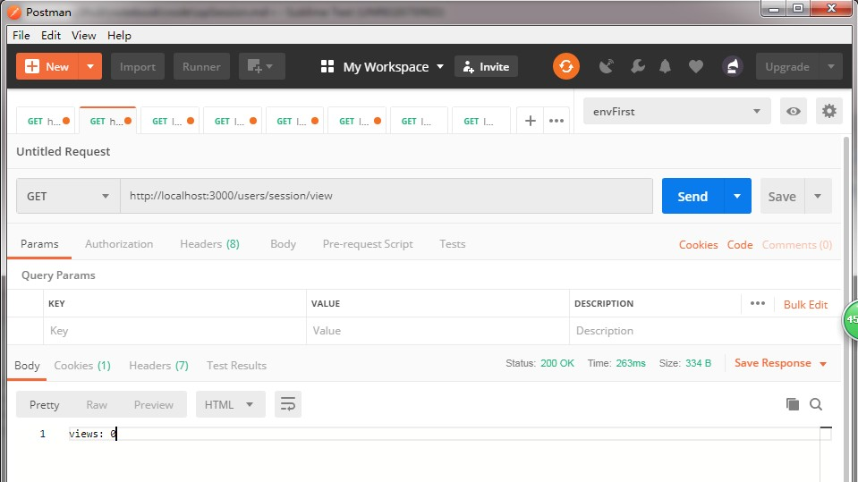

# express框架下使用session

上一遍文章说了cookie的不足，提到使用session是解决缺点的一个方法。这遍文章说说怎么使用session.作者使用了文件保存session的方法。若用别保存方式（内存、数据库）也行，记得使用相应的模块。  
下面从使用内存存储和文件存储的2个方法分别说明。  

## 内存存储session

### 实现过程

    // app.js
    // 引入express-session
    var session = require('express-session')
    // 为应用绑定session中间件
    app.use(session({
        name: 'session-id',
        secret: '12345-67890',
        saveUninitialized: false,
        resave: false
    }))

### 查看结果

    router.get('/session/first', (req, res, next) => {
      let s = req.session
      console.log(s)
      res.send(s)
    })

### 使用

使用这个方法做一个demo.比如显示浏览次数。

    router.get('/session/view', (req, res, next) => {
      let s = req.session
      if (req.session.views) {
        req.session.views++
        res.send(`views: ${req.session.views} time.`)
      } else {
        req.session.views = 1
        res.send('views: 0')
      }
    })

  
我发现在操作session后，会在根目录下创建一个session目录，里面保存了session.

## 文件存储session

相对于内存存储session不同在于保存session的位置不同。内存存储方式是把session保存在session里。对于后台服务会占用大量内存，这种方法肯定不行。文件存储方式是把session保存在文件夹里。听说还有一种叫数据库保存。

### install

要使用文件存储session需要安装`session-file-store`。

    npm i express-session session-file-store

## 使用文件存储

    // app.js
    var session = require('express-session')
    var FileStore = require('session-file-store')(session) // 引入 
    // 在express-session中使用
    app.use(session({
      name: 'session-id',
      secret: '12345-67890',
      saveUninitialized: false,
      resave: false,
      store: new FileStore() // 指明使用文件存储
    }))

## 注册、登录、登录验证和登出

### 1. 创建user的model，用于连接数据库。

在项目根目录下创建models目录，再创建user.js

    // @/models/user.js

### 2. 连接数据库

    // app.js
    const mongoose = require('mongoose')
    const url = 'mongodb://localhost:27017/confusion'
    const connect = mongoose.connect(url, {useNewUrlParser: true, useCreateIndex: true})
    connect.then(db => {
      console.log('Connect correct to server')
    }, err => {console.log(err)})

### 2. 创建注册的接口。

注册的接口
    是否已经存在用户------存在------>不重复创建.
            |-----------不存在----->创建用户

    // @/routes/users.js

### 3. 创建登录的接口。

登录的接口
    是否已经登录------登录------>不做事
        |-----------没登录----->验证username/password是否正确.----正确---->设置已经登录
                                        |----------------------不正确---->返回错误

### 4. 创建登出的接口。

### 4. 编写登录验证的中间件。注意登录接口、登录验证中间件、登录后才可访问的接口的次序。

## 什么时候删除session

## express-session 文档
## session-file-store 文档
