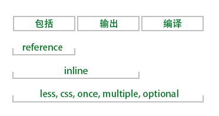
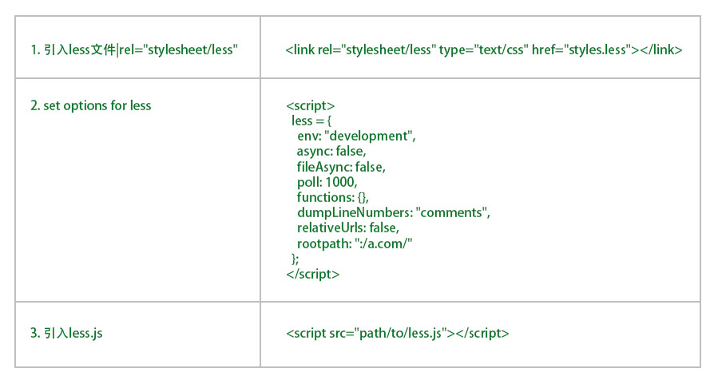

#less

less(leaner style sheets)向后兼容的css扩展语言。  
运行于node.js、服务器端。  
把把less文件转换为css文件。  

##install

    npm i less
    npm i less -g

若需要less.js把less文件编译为css文件，需要全局安装less.这样才能做在命令行里使用`lessc`

##usage

###variables

以@开头。  
用在属性值时： @var  
用在selector name/property name/url...时： @{var}  
使用变量指向变量名称时。注意@的数量。  
注意变量作用域。  
属性名作为变量名是不是@开关，是$开头。（$prop）  
最后定义的变量值会覆盖以前写的变量值。  

###parent selector

&  
&-name  
改变selector order: .select & => .select &

###mixins

写一套样式，多个地方使用。  
混合守卫。  
若在cssset上使用`!important`则会作用于此样式集的每一个样式上。  

###nesting 

&代表父选择器。  

###operation

各算术操作符都可用于的less.带单位也行。  

###extend(cssset)

把选中的样式集合并到当前选择器中。  
`selector:extend(otherSelector all)` // 合并所有来自otherSelector里的cssset.  

###function

    // define
    .class() {
        font-size: 23px;
        .first {
            ...
        }
        .second {
            ...
        }
    }
    // use
    .other {
        color: @orage;
        font-size: .class[first];// 使用classs类进而的font-size的数据值
        .class.first(); // 使用class类里的first类里的样式
    }

###map

使用ruleset的样式时使用[]  

    #colos () {
        primary: blue;
        secondary: green;
    }
    .button {
        color: #colors[primary];
        border: 1px solid #colors[secondary];
    }

###scope

在作用域链是依次寻找。  

###comments

    /* ... */
    // ...

###importing

    @import 'name'
    @import 'name.css'
    @import (keyword) 'file.suffix'

|keyword|explain|可以使用多个keyword|
|-|-|-|
|reference|使用这个less文件编译，但是不输出它。||
|inline|引入、输出这个文件，但不编译它。||
|less|把这个文件按照less文件处理。不管后缀名是什么。||
|css|把这个文件按照css文件处理。不管后缀名是什么。||
|once|只引入一次|默认值|
|multiply|可以引入多次||
|optional|只有存在时才import。||  

  

###服务端和命令行的用法

    lessc [option option=parameter ...] <source> [destination]
    // lessc name.less toname.css

###less 的 option

|||
|-|-|
|lessc --silent||
|lessc --version||
|lessc --help||
|lessc --depends||
|lessc --no-color||  

###在浏览器中使用

第一种： 单独设置options  
  

第二种： 在script标签中以`data-`属性的方法设置options  

    

第三种： 在link标签中以`data-`属性的方法设置options    

注意：  

- 先加载less.js再加载***.less  
- 使用同源加载。  

options详解

|关键字|说明|值|
|-|-|-|
|env|环境|'development'/'production'|
|async|是否异步加载文件|Boolean/false|
|fileAsync|当前页面是否使用异步加载文件|Boolean/false|
|poll|多长时间监测一次mode|Integer/1000|
|errroReporting|当编译失败时使用什么方式报告。|'html'/'console'/'function'|
|logLevel|显示哪些输出。0-nothing 1-error 2-info/error|Number|
|function|???||
|relativeUrls|当加载失败时修改less文件的url|Boolean/false|
|useFileCache|是否缓存|Boolean/true|

所有现代浏览器（ie11+）都支持less.编译文件可以在服务端和客户端运行。但二者有区别。在服务端运行时等待时间会较长。性能稳定。在客户端运行等待时间较短，性能有时不稳定。  
使用在服务端提前把less文件渲染成css文件。  

less 跨平台的设置项  

|option|example|说明||
|-|-|-|-|
|Include Paths|`lessc --include-path=PATH1;PATH2` `{paths: ['PATH1', 'PATH2']}`|把指定路径的文件加入编译工作||
|Rootpath|`lessc -rp=resources` `lessc--rootpath=resouces` `{rootpath: 'resources/'}`|设置根目录||
|Relative URLs|`lessc -ru` `lessc --relative-urls` `{relativeUrls: true}`|是否使用相对链接（默认使用绝对链接）||
|Strict Math|`lessc -sm=on` `lessc --strict-math=on` `{strictMath: true}`|是否使用严格数学运算(默认off/false)。false：会计算所有用到算术符号的表达式。true：只计算括号里的用到算术符号的表达式。||
|Strict Units|`lessc -su=on` `lessc --strict-unit=on` `{strictUnits: true}`|是否使用严格单位。当进行算术运算时出现单位不正确时如何操作。默认为false/off。false:将错就错算出结果。true：若出现单位错误就报错。||
|Global Variables|`lessc --global-var="color1=red"` `{globalVars: {color1: 'red'}}`|设置全局变量。||
|Modify Variables|`lessc --modify-var="color1=red"` `{modifyVars: {color1: 'red'}}`|改变全局变量的值||
|URL Arguments|`lessc --url-args="cache724522"` `{urlArgs: 'cache724522'}`|为每一个url添加参数||
|Lint|`lessc --lint -l` `lint: true`|检查less文件中的错误，并输出。||
|Compress|`lessc --compress -x` `{compress: true}`|是否压缩||
|Allow Imports from Insecure HTTPS Hosts|`lessc --insecure` `{insecure: true}`|是否可以从不安全的http中引入文件。||
|Source Map Options||||
|Generate a Source Map|`lessc --source-map` `{sourceMap: {}}`|生成sourceMap||
|Source Map Rootpath|`lessc --source-map-rootpath=dev-files/` `{sourceMap: {{sourceMapRootpath: 'dev-files/'}}`|||
|Source Map Output Filename|`lessc --source-map=file.map` `{sourceMap: {outputFilename: 'file.map'}}`|source map 的文件名||
|Source Map Basepath|`lessc --source-map-basepath=less-files` ``|||
|Include Less Source in the Source Map|`lessc --source-map-include-source` `{sourceMap: {outputSourceFiles: true}}`|是否在source map 文件里包含source 文件||
|Source Map Map Inline|`lessc --source-map-inline` `{sourceMap: {sourceMapFileInLine: true}}}`|是否在行内写入source map||
|Source Map URL|`lessc --source-map-url=../my-map.json` `{sourceMap: {soruceMapURL: '../my-map.json'}}`|设置source map的路径||
|Pre-Loaded Plugin||在加载less.js前加载指定的文件||

###node中使用要less的插件  

1. install `npm i less-plugin-myplugin`  
2. use `lessc --myplugin`  
3. 注册 `lessc --plugin=myplugin`  
4. 为插件设置配置 `lessc --myplugin="advenced"` / `lessc --plugin=myplugin=advanced`  

###编程的方式使用less

    less.render(lessInput, options).then(function (output) {
        // output.css = string of css
        // output.map = string of sourcemap
        // output.imports = array of string filenames of the imports referenced
    }, function (error) {
        // operate error
    })
    // or
    less.render(css, options, function(error, output) {})

    less.logger.addListener({
        debug: function (msg) {...},
        info: function (msg) {...},
        warn: function (msg) {...},
        error: function (msg) {...}
    })

##less函数

|name|parameter|explain|example|
|-|-|-|-|
|Misc Funciton 杂乱的方法||||
|color('str')||根据颜色格式的字符串返回颜色值||
|image-size('file.png')||返回图片的宽度、高度||
|image-height('file.png')||返回图片的高度||
|image-width('file.png')||返回图片的宽度||
|convert(value, 'unit')|value: 值+单位。unit: 单位|把value变为unit(单位)的数据。||
|data-uri(mimeType, url)|mimeType: 数据类型。url:资源路径。|把指定资源转换为指定类型。||
|default()|无参数|默认值|`.m(@x) when (default()) {color: @x}` `.m(@x) when not (default()) {...}`|
|unit(dimension, unit)|dimension: 只有数值。无单位。unit: 单位|返回有单位的数据||
|get-unit(value)||返回value的单位。无单位时返回'//nothing'||
|svg-gradient(dirction, color0[, position0] [, color1, position1...], color3[, position3])||设置渐变色||
|if(condition, value0, value1)||condition为true时返回value0,否则返回value1|condition可以使用 `not`, `and`, `or`关键字|
|String Function||||
|escape('str')||编码字符串|escape('a=1') a%3D1 (不能编码的字符,/?@&+~!$)|
|e||||
|%(string, arguments)|sSdDaA%|||
|replace(string, pattern, repalcement, flags)|string:需要replace的字符串。pattern:正则字符串。replacement:替换的字符串。flags：作用范围（gi/可省）|||
|List function||||
|length(value, value2, value3)||返回values的长度||
|extract(list, index)||返回list中index的value||
|Math Function||||
|ceil(float)||向上取整|ceil(2.4) => 3|
|floor(float)||向下取整||
|percentage(小数)||返回百分值||
|round(Number, decimalPlaces)||保留多少位小数||
|sqrt(value)||返回保持单位不变的情况下，值的平方。||
|abs(value)||返回绝对值value||
|sin(value)||返回保持单位不变。值的平方||
|asin(Number)||返回反正弦值。||
|cos(value)||||
|acos(Number)||||
|tan(value)||||
|atan(Number)||||
|pi()||得到pi的值||
|pow(value, Number)||返回保持单位不变，值的指定次方。||
|mod(value, Number)||求余||
|min(value, value1, ...)||返回最小值||
|max(value, value1, ...)||返回最大值||
|Type Function||它们都是小写字母||
|isnumber(value)||返回value是否可以转换为Number类型。||
|isstring(value)||是否可转换为String类型||
|iscolor(value)||||
|iskeyword(value)||||
|isurl(value)||||
|ispixel(value)||是否是px单位||
|isem(value)||||
|ispercentage(value)||||
|isunit(value, unit)||value的单位是否与指定的单位一样||
|isruleset(value)||value是否是一个css样式集合。||
|Color Definition Function||||
|rgb(red, green, blue)|0-255/0-100%|返回16进制颜色值||
|rgba(red, green, blue, alpha)||rgba(...)||
|argb(color)|color / color object|#aarrggbb|argb(rgba(90, 23, 148, 0.5) => #80511794)|
|hsl(hue, saturation, lightness)||#rrggbb||
|hsla(hue, saturation, lightness, alpha)||rgba||
|hsv(hue, saturation, value)|color|#rgb||
|hsva(hue, saturation, value, alpha)||rgba||
|Color Channel Function||||
|hue(color)||得到hsl的hue值。0-360||
|saturation(color)||得到hsl的saturation值。0-100||
|lightness(color)||得到hsl的lightness值。0-100||
|hsvhue(color)||得到hsv的hue值。||
|hsvsaturation(color)||得到hsv的saturation值。||
|hsvvalue(color)||得到hsv的value值。||
|red(color)||得到red值||
|green(color)||得到green值||
|blue(color)||得到blue值||
|alpha(color)||得到alpha值||
|luma(color)||||
|luminance(color)||||
|Color Operation Functions||||
|saturate(color, amount, method)|color, amount: 改变亮度的量。method。？？？|增加亮度||
|desaturate(color, amount, method)|减少亮度|||
|lighten()||||
|darken()||||
|fadein()||||
|fadeout()||||
|fade()||||
|spin()||||
|mix(color1, color2, weight)|weight:第一种颜色占的比重|返回2种颜色混合后的颜色。||
|tint(color, weight)||返回指定颜色与白色混合后的颜色。||
|shade(color, weight)||返回指定颜色与黑色混合后的颜色。||
|greyscale(color)||返回无色相的颜色 <=> desaturate(color, 100%)||
|contrast()|???|||
|Color Blending Functions||||
|multiply||||
|screen||||
|overlay||||
|softlight||||
|hardlight||||
|difference||||
|exclusion||||
|average(c1, c2)||返回2个颜色的平均值。||

##less的功能

|||||
|-|-|-|-|
|操作选择器||||
|操作color||||
|嵌套||||
|样式合并||||
|map||||
|||||

---

2018/12/18 by stone