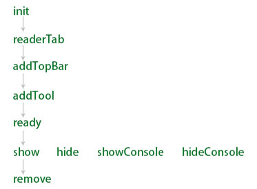
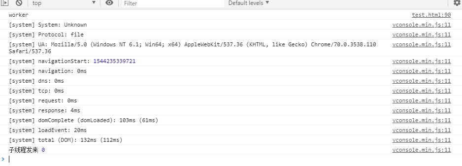

#vconsole

为移动端开发的前端开发工具。  

##function

1. 查看console日志。  
2. 查看network请求。  
3. 查看文档元素。  
4. 查看cookie/localstorage.  
5. 执行手写的js命令。  
6. 自定义插件。  

##install

    npm i vconsole
    

##usage

    // 非AMD/CMD
    let vConsole = new VConsole()
    // AMD/CMD
    let VConsole = require('vconsole/path/vc.js')
    let vConsole = new VConsole()
    // 与vue结合使用时若严格使用eslint准备会报“只加载未使用的problem” // 我也不会解决这个问题。

实例化后才能使用。  
直接使用。与console.log无区别。  
console.log('system', value) // 会把value输出支system.  

##api

|名称|说明|参数|result|
|-|-|-|-|
|属性||||
|vConsole.version|得到vConsole.的版本号|只读，string||
|vConsole.option|得到配置项|object|{defaultPlugins: ['systom', 'network', 'element', 'storage'], onReady: fn, onClearLog: fn, maxLogNumber: Number, disableLogScrolling: Boolean}|
|vConsole.activeTab|设置当前处于激活态的tab的plugin id|只读，String||
|vConsole.tabList|得到已安装的tab的plugin id|中读，string||
|vConsole.$dom|得到html（dom对象）|||
|vConsole.set||||
|方法||||
|vConsole.setOption(object/key:[,value])|设置配置项||-|
|vConsole.destroy()|在页面中移除vConsole|||
|vConsole.addPlugin(pluginId)|添加一个插件||vConsole.option得到的对象中的defaultPlugins里，vConsole把他们每一项叫做一个插件。如：需要添加systom插件，则`vConsole.addPlugin('systom')`|
|vConsole.removePlugin(pluginId)|卸载一个插件|||
|vConsole.showTab(pluginId)|激活指定的plugin|String|执行此方法时触发激活态tab的`hide`事件，再触发指定plugin的`show`事件|
|vConsole.show()|显示vConsole|-|触发`showConsole`|
|vConsole.hide()|隐藏vConsole|-|触发`hideConsole`|
|vConsole.showSwitch()|显示vConsole的开关按钮|-||
|vConsole.hideSwitch()|隐藏vConsole的开关按钮|-||  
|辅助函数||||
|vConsole.tool.isString(value)||||
|vConsole.tool.isArray(value)||||
|vConsole.tool.isBoolean(value)||||
|vConsole.tool.isElement(value)||||
|vConsole.tool.isFunction(value)||||
|vConsole.tool.isNull(value)||||
|vConsole.tool.isNumber(value)||||
|vConsole.tool.isObject(value)||||
|vConsole.tool.isSymbol(value)||||
|vConsole.tool.isUndefined(value)||||
|vConsole.tool.htmlEncode(String)|把string里的符号使用转义符号|||
|vConsole.tool.setStorage(key, value)|把数据存到`localStorage`里。`key`会被添加上`vConsole_`前缀。|||
|vConsole.tool.getStorage(key)|在`localStorage`中取出`key`对应的数据。（在keyk 不用添加`vConsole_`前缀）|||
|vConsole.$.one(selectors, baseElement)|基于baseElement得到第一个相应元素。|selectors:String, 多种选择方式时使用空格做做分隔。baseElement默认为document.可省略。|dom对象|
|vConsole.$.all(selectors, baseElement)|基于baseElement得到所有的相应元素。|同上|dom对象|
|vConsole.log()||||
|vConsole.$.addClass(elements, className)|给指定元素添加class|||
|vConsole.$.removeClass(elements, className)|把指定元素的class属性中移除指定的className|||
|vConsole.$.hasClass(element, className)|判断一个dom元素是否有className|||
|vConsole.$.bind(elements, eventType, fn, useCapture)|为一组dom对象添加指定事件类型对应的函数，是否冒泡（默认false）。|||
|vConsole.$.delegate(element, eventType, selectors, fn)|为一个指定的元素的符合selectors的子元素绑定eventType事件执行fn函数|||
|vConsole.$.render(templateString, data, toString)|使用有templateString把data编译成dom对象(toString: false)/html字符串（toString:true）|||  

##编写插件

1. 实例化插件  
2. 绑定插件事件  
3. 将插件添加到vConsole  

###1. 实例化插件

    let pluginName = new VConsole.VConsolePlugin(id, name)

###2. 绑定插件事件

为些插件绑定（vConsole已经预设的）事件类型对应的函数。 
可以绑定很多事件
    
    pluginName.on(eventType, fn(){})

###3. 将插件添加到vConsole

    let vConsole = new VConsole()
    let pluginName = new VConsole.VConsolePlugin(PluginId, nameOfShowAtTab)
    // 为插件绑定事件
    pluginName.on('renderTab', function () {
        let html = '
hello
'
        callback(html) // 必须执行此方法才能渲染插件。
    })
    vConsole.addPlugin(pluginName)

###插件的事件类型

|事件类型|说明|执行函数的参数|返回|
|-|-|-|-|
|init|插件被初始化时触发|||
|renderTab|渲染tab时触发。如果不需要添加新tab请不要绑定此事件|fn(html)||
|addTopBar|当添加头部按钮时触发|带有按钮配置信息（obj）的数组[{name:'', data: obj, className: '', onClick: fn(){}}]||
|addTool|添加tool按钮时触发|callback需要的参数是一个包含按钮配置信息的数组[{name: 按钮上的文字, global: Boolean是否是全局可见, onClick: fn点击按钮时触发的函数}]||
|ready|成功安装插件后触发|-||
|remove|当前插件被卸载时触发|-||
|show|当前tab被显示时触发|-||
|hide|当前tab被隐藏时触发|-||
|showConsole|vConsole显示时触发|-||
|hideConsole|vConsole隐藏时触发|-||
|updateOption|当执行setOption()时触发|-||

    PluginName.on('eventType', callback)

###事件顺序图

  

##限制

这是一个使用vConsole的例子。  

  

在实例化vConsole之前使用console.log('')输出内容可以找到输出来源、行号。实例化后都是由vConsole输出的。看不到输出来源、行号。  

开发时使用vConsole不容易定位输出代码。  

##思考

为自定义的插件绑定事件时触发函数的参数都是callback。这个函数中生成callback函数需要的参数，然后执行callback。可能vconsole的开发者在这个里使用了高阶函数。我在学习这块内容时想了半天才得到这个答案。  
学习笔记来自git上的官方文档。作者写的很好。  

##未来用途

设置addTool触发事件。这个事件的执行函数可由开发者任意写。  
些插件不仅有显示输入的功能，还有操作dom的功能。  

---

2018/12/08 by stone