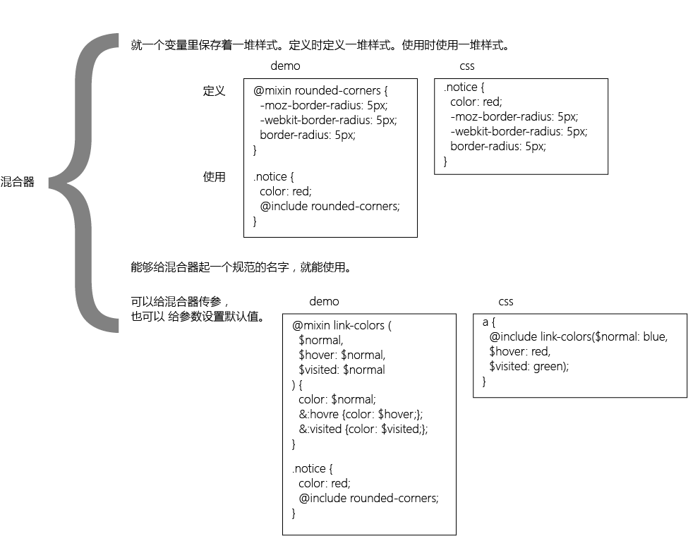

#sass
对css的一种简便写法。  

##可以分为6块内容
变量、嵌套、导入、注释、混合器、继承。

###使用变量
  

###使用嵌套
  

###使用导入
  

###使用注释
  

###使用混合器
  

###使用继承
  

###关键字
|关键字|意义|关键字|意义|
|-|-|-|-|
|@import|引入|||
|@mixin|定义混合|@include|使用混合|
|@extend|继承|||
