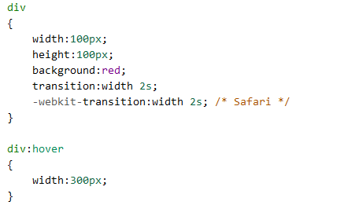

# transition #
一种样式转变到另一个样式  
**工作需要**  
- 改变一个属性：属性名+空格+过渡时间  

	transition: width 2s;  

- 改变多个属性：用逗号分割  

	transition: width 2s, height 1s, background-color 0.5s  

- transition  
- transition-property  none|all|property
- transition-duration  time
- transition-timing-function  linear|ease|ease-in|ease-out|cubic-bazier(n,n,n,n)
- transition-delay  

----------
1/17/2018 12:10:21 PM 