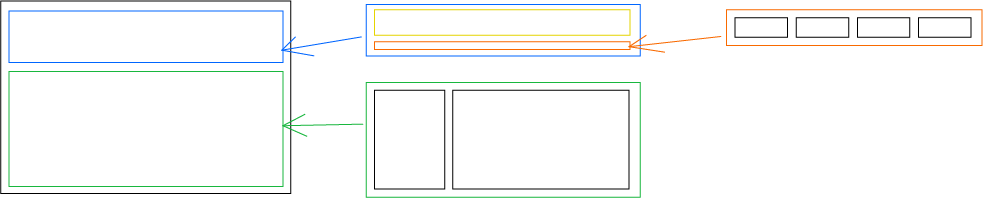
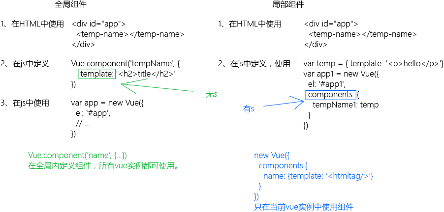

#vue  
向下不兼容ie8。向上兼容es6。 

**引入`<script>`**   
开发版本：包含完整的调试、警告。  
生产版本：删除了调试。

**预安装**  
1. node.js >= 6.x  
2. npm 3+  
3. git

安装好node.js后就会安装好npm.(node6.+包括npm)  

##安装方法一  

	npm install --global vue-cli
	vue init webpack vuetest
	cd vuetest
	npm install
	npm run dev

##安装方法二  

	cnpm install vue-cli -g
	vue init webpack-simple first-vue
	cd first-vue
	npm install
	npm run dev
	npm run build

*tip:*为了打包后文件引用路径正确，需要修改config/index.js assetsPublicPath: './' (根据实际情况修改)

##混合
**基础**  
混合对象可以包含任何组件选项。当组件使用混合对象是所有混合对象的选项将会混入到组件本身的选项中。  
**选项合并**  
> 1. 同名钩子函数将混合为一个数组，然后行调用混合对象中的钩子函数再调用组件自身中的钩子函数。  
2. 值为对象的选项，例如 methods, components 和 directives，将被混合为同一个对象。两个对象键名冲突时，取组件对象的键值对。  

**全局混合**  
一旦使用全局混合对象，将会影响到 所有 之后创建的 Vue 实例。使用恰当时，可以为自定义对象注入处理逻辑。  
**自定义选项合并策略**  
> 1. Vue.config.optionMergeStrategies
2. 更多高级的例子可以在 Vuex 的 1.x 混合策略里找到：

	const merge = Vue.config.optionMergeStrategies.computed
	Vue.config.optionMergeStrategies.vuex = function (toVal, fromVal) {
	  if (!toVal) return fromVal
	  if (!fromVal) return toVal
	  return {
	    getters: merge(toVal.getters, fromVal.getters),
	    state: merge(toVal.state, fromVal.state),
	    actions: merge(toVal.actions, fromVal.actions)
	  }
	}

##数据与方法
Object.freeze( obj )// 响应系统无法跟踪`obj`的变化  
Vue 实例还暴露了一些有用的实例属性与方法。它们都有前缀 $，以便与用户定义的属性区分开来。  
使用	`Vue.set(object, key, value )`方法向`data`添加数据  

- Vue.set(vm.user, 'age', 23)  
- vm.$set(this.user, 'age', 32)
- this.user = Object.assign({}, this.user, {age:28, favorite: 'apple'})  

  

	new Vue({
		el: '#app',
		data: {},
		beforeCreate: funciton () {},
		created () {},
		beforeMount: function () {},
		mounted () {},
		beforeUpdate () {},
		updated () {},
		beforeDestroy () {},
		destroyed () {},
	})

## 模板语法 ##
Vue.js 使用了基于 HTML 的模板语法，允许开发者声明式地将 DOM 绑定至底层 Vue 实例的数据。所有 Vue.js 的模板都是合法的 HTML ，所以能被遵循规范的浏览器和 HTML 解析器解析。  
在底层的实现上，Vue 将模板编译成虚拟 DOM 渲染函数。结合响应系统，在应用状态改变时，Vue 能够智能地计算出重新渲染组件的最小代价并应用到 DOM 操作上。  
**插值**  
文本：{{msg}}  
原始html：v-html="htmlvar"  
特性：v-bind:id="dynamicId"(缩写:id="dynamicId")  
使用js表达式：{{number+1}},{{ok?yes:no}}  
**指令**  
v-if="boolean"  
v-bind:title="message"  
v-on:click="methods"  
v-on:click.prevent="methods"
就是event.preventDefault()  
缩写@click="methods"  
##计算属性和观察者
在页面初始化时计算一次并保存在缓存中，当依赖没有改变时返回缓存中的结果，当依赖改变时重新计算再返回新结果。  
默认只提供get方法  
	computed: {
		fullname: function () {
			return this.firstname + this.lastname
		}
	}
也可以设置set方法  

	computed: {
		fullname: {
			get: function () {
				return this.firstname + " " + this.lastname
			},
			set: function ( name ) {
				//return this.fir
				this.firstname = name.split(' ')[0];
				this.lastname = name.split(' ')[name.length-1]
			}
		}
	}
**侦听器**  
vue通过watch选项提供一个当需要数据变化时执行异步操作或操作开销较大时使用的方法。
## class与style绑定 ##
**class**  
1. `v-bind:class="{active:isActive}"`
2. `

  
data: {
  isActive: true
  hasError: false
}`
3. `

 data:{classObj:{active:true,'text-danger':false}}`
4. `

 data:{active: "active", errorclass="error"}`
5. `

`
6. 父组件、子组件上的class都会被应用到渲染出来的html上。  
**style**  
`v-bind:style`是一个js对象。css属性名可以使用驼峰式或短横分隔  
1. `

 data:{activeColor:'red',fontSize:36}`  
2. `

 data:{styleobj:{color:'red'}}`  
3. `

`   
4. `

`  

## 条件渲染 ##
`v-if`是否渲染当前元素  
1. 在`<template>`元素上使用`v-if`会成组渲染  
2. `v-else`必须与`v-if`组合使用。与if-else语法类似  
3. `v-else-if`必须与`v-if`组合使用。与if-else语法类似  
4. `key`使`v-if``v-else`里的元素完全独立，不复用它们。

	<template v-if="loginType === 'username'">
	  <label>Username</label>
	  <input placeholder="Enter your username" key="username-input">
	</template>
	<template v-else>
	  <label>Email</label>
	  <input placeholder="Enter your email address" key="email-input">
	</template>

`v-show`是否显示出来。实际上已经渲染出来了，只是`display:none`，看不到。  
`v-for`比`v-if`的优先经高。  
## 列表渲染 ##
**循环**  
1. 循环数组：`<li v-for="(item, index) in items"></li>`    
2. 循环对象：`<li v-for="(item, key, index) in items"></li>`  
`key`表示每一项的唯一key属性。它是vue的保留字不能用于其它地方。  
**过滤**  
使用computed、methods返回处理的数据    

- `<li v-for="n in computedNumber"></li>`  
- `<li v-for="n in methodNumber(nums)"></li>`

**取值范围**  
`{{ n }} `  

**循环组**  

	<ul>
	  <template v-for="item in items">
	    <li>{{ item.msg }}</li>
	    <li class="divider"></li>
	  </template>
	</ul>

**循环组件**  

`<my-component v-for="item in items" :key="item.id"></my-component>`  
`key`是必须的，它用来区分组件。  

## 事件处理 ##
**事件修饰符**  

- `` 阻止事件继续传播  
- `` 阻止默认事件  
- `` 使用事件捕获模式  
- `` 只当有event.target是当前元素时才触发函数  
- `` 只触发一次  

**按键修饰符**  

- `<input @keyup.13="submit">`  
- `<input @keyup.enter="submit">`  
- `<input @keyup.tab="submit">`  
- `<input @keyup.delete="submit">`  
- `<input @keyup.esc="submit">`  
- `<input @keyup.up="submit">`  
- `<input @keyup.down="submit">`  
- `<input @keyup.left="submit">`  
- `<input @keyup.right="submit">`  

**自定义按键修饰符别名**  

	Vue.config.keyCodes.f1 = 112// 可以使用'v-on:keyup.f1' 

**系统修饰健**  

- `<input @keyup.alt.67="clear">` // alt + a  
- `
do
` // ctrl + 单击  
- `
do
` // shift + 单击  
- `
do
` // meta + 单击  
- `
do
` // 有且只有ctrl + 单击时触发  

**鼠标按钮修饰符**  

- `
do
`  
- `
do
`  
- `
do
`  

## 表单输入绑定 ##

用 `v-model` 指令在表单 `<input>` 及 `<textarea>` 元素上创建双向数据绑定。但 v-model 本质上不过是语法糖。它负责监听用户的输入事件以更新数据，并对一些极端场景进行一些特殊处理。   
## 组件 ##

  

  

## 使用图片

**在img中使用图片。**  

	import imgSrc from '@/asstes/images/xxxx.png'

	data () {
		return {
			src: imgSrc
		}
	}
	
	

**在css中使用图片。（背景图片）**  

	import imgSrc from '@/assets/images/xx.png'

	data () {
		return {
			bgImg: {
				backgroundImage: 'url(' + imgSrc + ')'
			}
		}
	}

	

**static/非static**  

static文件夹下不用`require`  

	"imgPath": require('../../assets/logo.png')
	"imgPath": ('../../../static/logo.png')