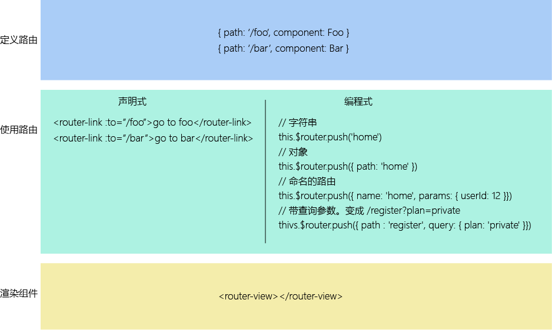
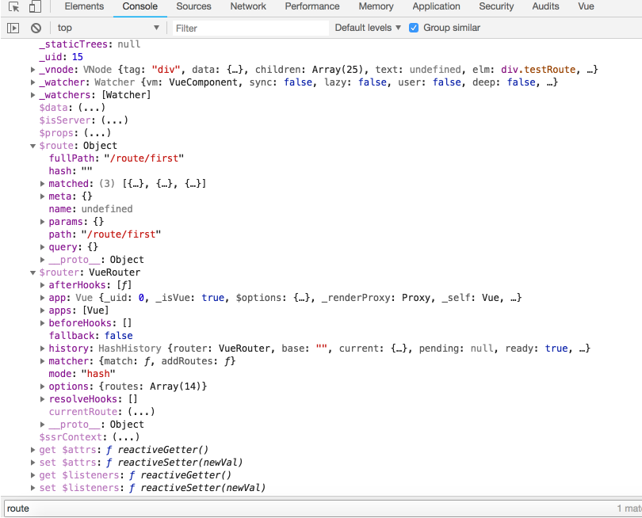
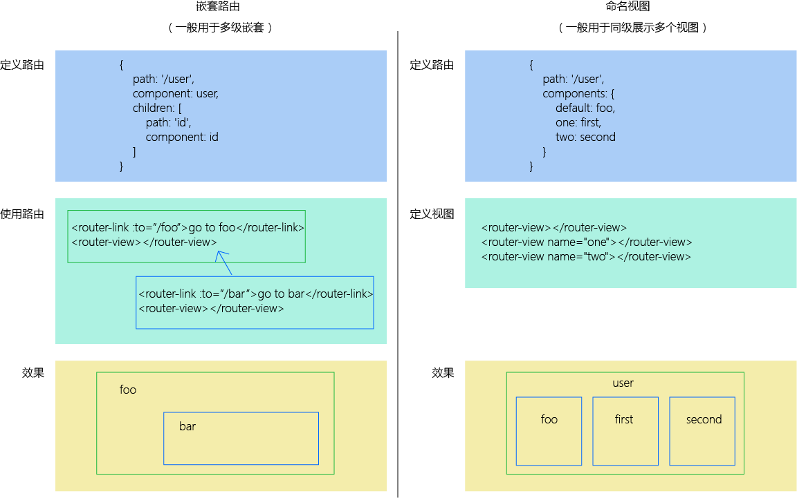

# vue-router 基础
## install
1. CDN  
	``
	``  
1. NPM  
	`npm install vue-router`  
	安装路由功能  

	`import Vue from 'vue'`  
	`import VueRouter from 'vue-router'`  
	`Vue.use(VueRouter)`
	
## 作用，使用

1. 定义组件与路由的映射。  
2. 定义渲染组件的位置。  

  

### $route & $router  

**this.$route // 路由记录**  
**this.$router // 路由实例**  

## 动态路由
*用处：* 在使用“动态路由参数”时会用到动态路由。  
*作用：*   

**定义：** router file  
    
    {
        path: '/user/:id',
        component: 'user'
    }

*注意：* 动态路由的动态部分改变时原来的组件会被复用，这样就不会触发生命周期钩子函数。若要触发请使用watch $route或beforeRouteUpdate  

**使用：** user file
    
    this.$route.params.id

## 高级匹配模式
（待续）  

## 优先级

越先定义优先级越高。  

## 嵌套路由&命名视图  

  

## router

    {
        path: '/user',
        name: 'name', // 命名路由
        component: user,
        alias: '/roler', // 别名
        redirect: { name: 'foo' }, // 重定向
        props: true // 将 this.$route.params 设置为组件属性
    }

### 命名路由  

就是给路由起个名字。方便使用。

    <router-link :to="{ name: 'user', params: { userId: 123 }}">user</router-link>

    this.$router.push({ name: 'user', params: { userId: 123 }})

### 重定向、别名。
### 路由组件传参  

**定义路由：** router file  

    {
      path: 'routeUser/:userId',
      // components: {
      //   default: eleThree,
      //   second: eleSecond
      // },
      // props: {
      //   default: true,
      //   second: true
      // },
      component: routeUser,
      children: [
        {
          path: '/',
          components: {
            default: routeSecond,
            second: routeThree
          },
          props: {
            default: dynamicDate,
            second: true
          }
        }
      ],
      props: true
    }

    function dynamicDate (route) {
      console.log(route)
      const now = new Date()
      return {
        date: now.getFullYear()
      }
    }

**定义组件：** routeUser file  

    
userId: {{userId}}

    <router-view></router-view>
    <router-view name="second"></router-view>

    props: ['userId']

|-|-|
|1. 布尔模式|将 this.$route.params 设置为组件属性|
|2. 对象模式|按原样设置为组件属性|
|3. 函数模式|方便做更多的操作|  

## HTML5 History模式
（待续）  

## vue服务端渲染文档
（待续）  

----
2018.07.26 by stone