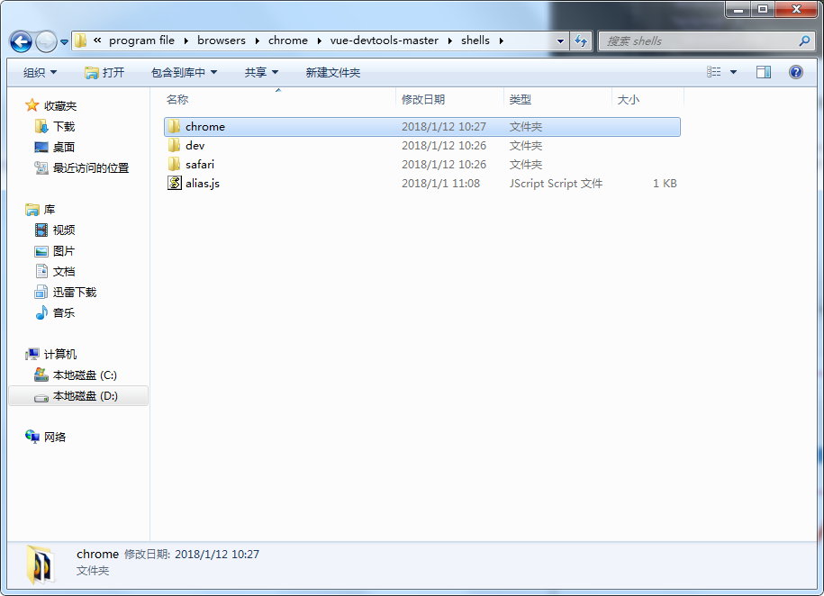
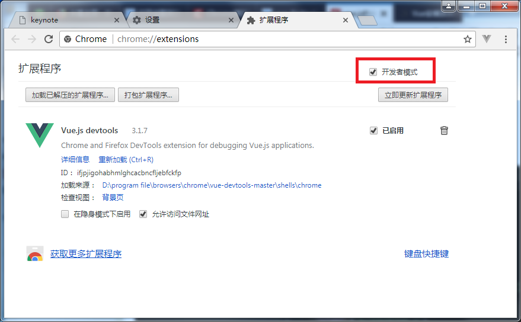

#vuedevtools安装方法  

1. github下载地址：https://github.com/vuejs/vue-devtools
2. 下载好后进入vue-devtools-master工程  执行npm install ----->npm run build.
3. 修改*/vue-devtools-master/shell/chrome/mainifest.json 中的persistant为true
4. 更多工具/扩展程序。勾选开发者模式。把*/vue-devtools-master/shell/chrome文件夹拖到chrome浏览器中  

  

**安装后需要重启一下。**  

#使用方法  

太简了。打开就会用。不使用写教程了。  

***  
1/12/2018 11:11:28 AM 