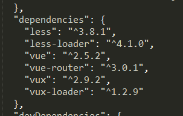

#vux

vux读作[v’ju:z]。它是主要用于移动端的基于`weui`和`vue`的ui组件库。  
看git上作者的描述很霸气。一种爱用不用的感觉。的pc端vue的ui框架有iview/elementui等。移动端使用vux较为方便。  
主要用于移动端的基于`weui`和`vue`的ui组件库。  

有专用的vux-loader。
使用css预处理工具是less.不影响开发者使用sass等。  

##安装  

  npm i vux

vux2必须配合vux-loader使用, 请在build/webpack.base.conf.js里参照如下代码进行配置：

    const vuxLoader = require('vux-loader')
    const webpackConfig = originalConfig // 原来的 module.exports 代码赋值给变量 webpackConfig

    module.exports = vuxLoader.merge(webpackConfig, {
      plugins: ['vux-ui']
    })

**最后效果**  

      

##前期准备。  

###1. 创建vue项目。  

###2. 修改webpack.base.conf.js  

  	const vuxLoader = require('vux-loader')
  	const webpackConfig = {
  		// .... module.exports里的东西
  	}
  	module.exports = vuxLoader.merge(webpackConfig, {
  		plugin: ['vux-ui']
  	})

##使用方法。  

###-. 局部注册  

  	// **.vue
  	<tag></tag>

  	import { ColorPicker } from 'vux'

  	export default {
  		components: {
  			tag: ColorPicker
  		}
  	}

###-. 全局注册

  	// main.js
  	import Vue from 'vue'
  	import { ColorPicker } from 'vux'

  	Vue.component('color-picker', ColorPicker)
  	// 在*.vue中引用的vux的组件后其下的子组件都可不用注册vux组件直接使用。  

##各组件的使用

看官网就行。使用起来很简单。  

---

2018/09/18 by stone