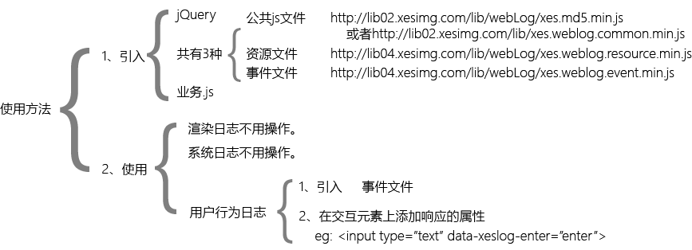

#web端打印用户行为日志和页面渲染完成日志规范
##这篇文章是做什么的？  
介绍如何使用打印用户行为日志和如何打印渲染日志。  

##usage
  

**交互行为属性表**  

|属性|值|说明|是否必填|
|-|-|-|-|
|data-xeslog-enter|enter|该元素在按下enter键时打印行为日志。(eg:input,textarea)|否|
|data-xeslog-params|key=xeslog_index_live_playback_www&action=look_livePlayback&targetHref=http://...|key: 当面页面位置。 action交互的行为操作。 targetHref: 目标链接。（非必须）|是|  

##ajax请求的目标  
这个东西我也不会。下面只写了我理解的部分。  
window.xesLog_ajaxSucessData=true;  
ajaxMsg  

##系统日志  
这个东西我也不会。下面只写了我理解的部分。  
var systemData = {
    'newLogid': logid,
    'systemError': 'error',
    'systemParams': 'key=yuyin&error=200'
};
xesWeb_eventLog.xesEventLog('systemLog',systemData);

##特殊情况配置  
这个东西我也不会。下面只写了我理解的部分。  
**页面渲染完成后打码字段**  
window.courseDataSearch = "key=load&value=12";
**ajax请求成功后是否传递返回的数据**  
window.xeslog_ajaxSuccessData = true
**ajax请求完成或失败时不需要发送日志**  
window.filterAjaxRequestConfig = ['http://172.88.0.161:8888', 'https://dj.xesimg.com/appid/a.gif']
**ajax请求成功后是否需要添加特殊字段**  
window.ajaxSuccessParamsConfig = 'eventid=live_79&testid=89';
**区分文理**  
window.isArtsConfig = 0|1;// 0: 理科，1: 文科，