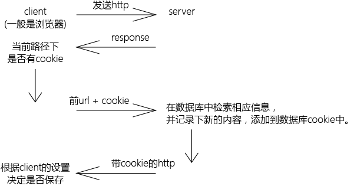

#前端存储
##简介
一种在前端保存数据的思想。第一次在页面中的保存数据，那么从第二次开始就可以使用了。可以使用的方法有：  

1. cookie
2. localeStorage
3. sessionStorage
4. ie的userData
5. web sql
6. indexedDB

从技术角度看待这些方法。没有高低之分，只有对特定任务是否合适。  

##cookie
###简介

1. cookie："小饼干，小甜品"
2. 参与http通信。因为在http中可以看到cookie，所以易受到攻击。
3. 面向路径。只作用于当前路径（页面）。
4. 每个cookie < 4K

###运行机制  
  

###使用  
  

###总结
**设置cookie的值**  

    function setCookie(key, value, duration) {
        // duration 单位为ms
        var d = new Date();
        document.cookie = key + "=" + value + "; " + d.getTime() + duration
    } 

**获取cookie的值**  

    function getCookie(key) {
        var cookieArr = document.cookie.split(';');
        for (var i = 0; i < cookieArr.length; i++) {
            var cookie = cookieArr[i].trim();
            if (cookie.indexOf(key)===0) {
                return cookie.substring(key.length, key.cookie.length);
            }
        }
    } 

##localStorage/sessionStorage  

1. localStorage < 5M  
2. localStorage的使用也是遵循同源策略的，所以不同的网站直接是不能共用相同的localStorage。可以在同网站下跨页面。  
3. sessionStorage只作用于当前页面。

**优势**  
1、localStorage拓展了cookie的4K限制  
2、localStorage会可以将第一次请求的数据直接存储到本地，这个相当于一个5M大小的针对于前端页面的数据库，相比于cookie可以节约带宽，但是这个却是只有在高版本的浏览器中才支持的  

**局限**  
1、浏览器的大小不统一，并且在IE8以上的IE版本才支持localStorage这个属性  
2、目前所有的浏览器中都会把localStorage的值类型限定为string类型，这个在对我们日常比较常见的JSON对象类型需要一些转换  
3、localStorage在浏览器的隐私模式下面是不可读取的  
4、localStorage本质上是对字符串的读取，如果存储内容多的话会消耗内存空间，会导致页面变卡  
5、localStorage不能被爬虫抓取到  

  

###使用  

一般在第一次加载页面时在本地保存好数据。从第二次开始使用本地保存的数据。为了保证前端性能，一般不会保存大量数据。只保存关键数据，再根据它做出判断后执行相应的程序。  

    window.localStorage//boolean 浏览器是否支持

写入(3种形式)  

    window.localStorage["a"] = 1;
    window.localStorage.b = 1;
    window.setItem('c',3);

读取  

    var a = window.localStorage.a;
    var b = window.localStorage["b"];
    var c = window.localStorage.getItem("c");
    var d = window.localStorage.key(d);

修改  

    window.localStorage.a = 4;

删除  

    window.localStorage.clear();// 清除据
    window.localStorage.removeItem("a");// 删除a

方法  

    localStorage.setItem('key', 'value');
    localStorage.getItem('key');
    localStorage.removeItem('key');
    localStorage.clear();

##ie的userData

只有window+ie10-才能可以使用。ie把数据放到c盘的user文件夹里。新浏览器出来了。旧浏览器又有各种不兼容。本着向前看的态度。不于讨论。  

##web sql

在前端创建一个类数据库的对象。使用和数据一样的语法增删改查。关闭页面后就没了。下次打开还需要再创建数据库。后来w3c也不维护了。本着向前看的态度。不于讨论。  

##indexedDB

spandataspan

##区别

|特性|cookie|localStorage|sessionStorage|userData|web sql|indexedDB|
|-|-|-|-|-|-|-|
|生命周期|一般由服务器生成，可设置失效时间。若在浏览器生成，默认关闭浏览器后失效。|在手动删除前一直存在|关闭当前页面后被清除||||
|可存放大小|<4k|<5m|<5m||||
|与服务器通信|每次都在http头部信息中。过多会影响性能|仅在客户端不能与通信|仅在客户端不能与通信||||
|易用性|原生的方法较难使用，自己封装后会好用。|原生的方法就挺好用。可再交封装|原生的方法就挺好用。可再交封装||||

---
2018/04/03 by stone
