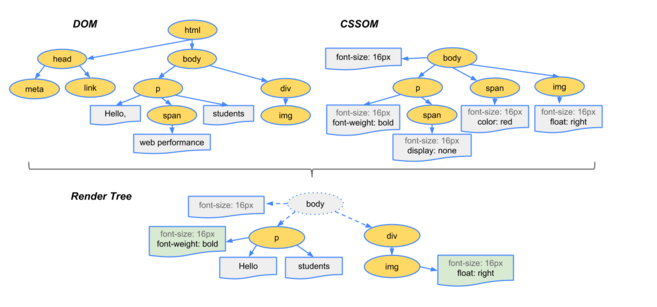
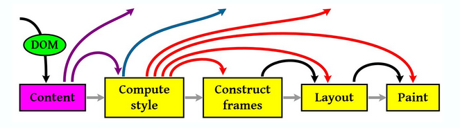

一般分为加载、解析、渲染，三个过程。  
这三个过程不是完全独立的。有时会有交叉。即一边加载、一边解析、一边渲染。  

DOM: Document Object Model  
CSSOM: CSS Object Model  
Render Tree： DOM/CSSOM合并后生成Render Tree.  
Layout: 计算出Render Tree每个节点的具体位置。  
Painting: 通过显卡，将Layout后的节点内容分别呈现到屏幕上。  

  

## 加载  

加载html时自上向下加载。  
遇到css.并行加载。  
遇到js.挂起渲染的线程。等js下载完成后，再继续下载html.  

1. html加载完后按照深度优先遍历来生成dom树。  
2. css加载完后生成相应的cssom.  
3. 再结合dom+cssom=>Render Tree  

## 渲染  

  

1. 把dom加载进来。  
2. 计算css样式。把相应的样式给与相应的dom元素上。  
3. 创建rander tree.  
4. 计算布局。（包括大小、定位、换行等。）  
5. 呈现在屏幕上。  

### Reflow  

回流。  

只要有dom元素的发生变化影响到了布局。就会发生回流。从html标签开始依次向下递归。进行从新布局。  

### Repaint

重绘。  

一个元素发生变化，不影响布局时，发生重绘。只对这一个元素修改。  

